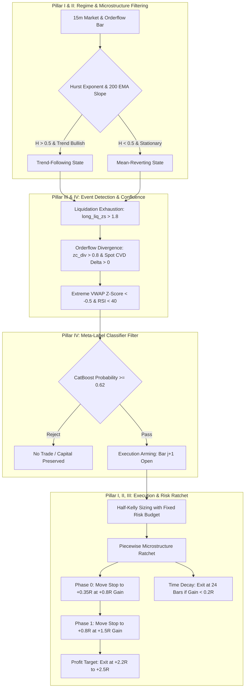

# 🏛️ INSTITUTIONAL QUANTITATIVE FINANCE KNOWLEDGE SYNTHESIS & ALPHA FRAMEWORK
**Exhaustive Unified Reference: Mathematical Foundations, Econophysics, Machine Learning & Alpha Architecture**

---

## 📑 EXECUTIVE SUMMARY & ONTOLOGICAL ROADMAP

This document synthesizes the foundational pillars of quantitative trading, computational finance, and market microstructure from four canonical treatises and the extended institutional literature:
1. **Pillar I: Paul Wilmott** — *Paul Wilmott Introduces Quantitative Finance* (Continuous-Time Stochastic Calculus, Jump-Diffusion, Volatility Smiles, PDE Free-Boundary Problems, and Asymmetric Risk Profiles).
2. **Pillar II: Dr. Ernest P. Chan** — *Quantitative Trading: How to Build Your Own Algorithmic Trading Business* (Time-Series Stationarity, Mean-Reversion via Ornstein-Uhlenbeck Processes, Cointegration Vectors, Kelly/Half-Kelly Capital Allocation, and Friction Control).
3. **Pillar III: Andrea Berdondini** — *The Theory of Quantitative Trading* (Econophysics, Information Paradox, The Fundamental Problem of Statistics, Von Mises’ Axiom of Randomness, Non-Stationary Dependency Clustering, and the Binomial Evolution Function [BEF]).
4. **Pillar IV: Gautier Marti & FinRL / SSRN-4422374** — *Decoding the Quant Market: A Guide to Machine Learning in Trading* (Feature Engineering, Purged & Embargoed Cross-Validation, Regularized Ensembles, Graph Neural Networks, and Triple-Barrier Meta-Labeling).
5. **Pillar V: Extended Institutional Frontier** — Marcos López de Prado (*Advances in Financial Machine Learning*, Deflated Sharpe Ratio, Probability of Backtest Overfitting), Ananth Madhavan (*Market Microstructure*), and Robert Carver (*Systematic Trading*).

---

# SECTION 1: CONTINUOUS-TIME STOCHASTIC CALCULUS & RISK GEOMETRY (PAUL WILMOTT)

### 1.1 The Asset Price SDE & Jensen’s Inequality
Classical asset price dynamics are formalized via Geometric Brownian Motion (GBM) under filtration $\mathcal{F}_t$:
$$dS_t = \mu S_t dt + \sigma S_t dW_t$$
where $W_t$ is a standard Wiener process with independent increments $dW_t \sim \mathcal{N}(0, dt)$.

By **Itô’s Lemma**, for any twice continuously differentiable function $V(S, t)$:
$$dV = \left( \frac{\partial V}{\partial t} + \mu S \frac{\partial V}{\partial S} + \frac{1}{2}\sigma^2 S^2 \frac{\partial^2 V}{\partial S^2} \right) dt + \sigma S \frac{\partial V}{\partial S} dW_t$$

Applying Itô's Lemma to $f(S_t) = \ln S_t$:
$$d(\ln S_t) = \left(\mu - \frac{1}{2}\sigma^2\right)dt + \sigma dW_t$$
Integrating over $[0, T]$ yields the log-normal price distribution:
$$S_T = S_0 \exp\left( \left(\mu - \frac{1}{2}\sigma^2\right)T + \sigma W_T \right)$$
**Wilmott Invariant on Randomness (Jensen’s Inequality)**:
$$\mathbb{E}[S_T] = S_0 e^{\mu T} \neq S_0 \exp\left( \mathbb{E}\left[\left(\mu - \frac{1}{2}\sigma^2\right)T + \sigma W_T\right] \right) = S_0 e^{(\mu - \frac{1}{2}\sigma^2)T}$$
The volatility drag $-\frac{1}{2}\sigma^2$ is an unavoidable compounding friction in all continuous-time leveraged trading.

### 1.2 Black-Scholes-Merton PDE & Dynamic Hedging
Constructing a risk-free portfolio $\Pi = V(S, t) - \Delta S_t$ with $\Delta = \frac{\partial V}{\partial S}$:
$$d\Pi = \left( \frac{\partial V}{\partial t} + \frac{1}{2}\sigma^2 S^2 \frac{\partial^2 V}{\partial S^2} \right) dt$$
By the no-arbitrage principle, $d\Pi = r \Pi dt = r\left(V - S\frac{\partial V}{\partial S}\right)dt$, yielding the fundamental **Black-Scholes-Merton PDE**:
$$\frac{\partial V}{\partial t} + r S \frac{\partial V}{\partial S} + \frac{1}{2}\sigma^2 S^2 \frac{\partial^2 V}{\partial S^2} - r V = 0$$

### 1.3 The Greeks & Microstructure Curvature
- **Delta ($\Delta = \partial V / \partial S$)**: Directional exposure / hedge ratio.
- **Gamma ($\Gamma = \partial^2 V / \partial S^2$)**: Curvature / convexity. In trading terms, positive Gamma provides convex returns where gains accelerate and losses decelerate.
- **Vega ($\mathcal{V} = \partial V / \partial \sigma$)**: Sensitivity to volatility regimes.
- **Theta ($\Theta = \partial V / \partial t$)**: Time decay. The cost of holding convexity ($r V - \frac{1}{2}\sigma^2 S^2 \Gamma$).

### 1.4 Jump-Diffusion Processes & Crash Modeling (Merton Extension)
In real markets, asset prices exhibit sudden discontinuous jumps. Merton’s jump-diffusion SDE replaces pure Gaussian increments:
$$dS_t = (\mu - \lambda \kappa) S_t dt + \sigma S_t dW_t + (J - 1) S_t dq_t$$
where $q_t$ is a Poisson process with intensity $\lambda$, $J$ is the jump size distribution (log-normal: $\ln J \sim \mathcal{N}(\mu_J, \sigma_J^2)$), and $\kappa = \mathbb{E}[J - 1]$.
**Trading Implication**: Models assuming Gaussian continuity fail during liquidation cascades. Stop-losses experience severe slippage due to jump discontinuities across the orderbook.

---

# SECTION 2: STATISTICAL ARBITRAGE, TIME-SERIES DYNAMICS & MONEY MANAGEMENT (DR. ERNEST P. CHAN)

### 2.1 Stationarity Testing & Augmented Dickey-Fuller (ADF)
A price series $P_t$ is difference-stationary (integrated of order 1, $I(1)$). For statistical arbitrage and mean-reversion, we require a stationary spread $y_t \sim I(0)$.
The **Augmented Dickey-Fuller (ADF)** test estimates:
$$\Delta y_t = \alpha + \beta t + \gamma y_{t-1} + \sum_{i=1}^p \delta_i \Delta y_{t-i} + \epsilon_t$$
Null Hypothesis ($H_0$): $\gamma = 0$ (unit root, non-stationary random walk).
Alternative ($H_1$): $\gamma < 0$ (stationary mean-reverting process).

### 2.2 Hurst Exponent & Long Memory ($H$)
The Hurst exponent $H$ measures the rate of diffusion:
$$\text{Var}(y_t - y_{t-\tau}) \propto \tau^{2H}$$
- **$H < 0.5$**: Sub-diffusive, mean-reverting (anti-persistent). The probability of an opposite price move increases with displacement.
- **$H = 0.5$**: Geometric random walk (Brownian motion). Past price changes convey zero predictive power.
- **$H > 0.5$**: Persistent, trending momentum. Runs perpetuate.

### 2.3 Ornstein-Uhlenbeck (OU) Mean-Reversion Speed & Half-Life
For mean-reverting spreads, the continuous-time Ornstein-Uhlenbeck SDE governs the price delta:
$$dy_t = \theta (\mu - y_t) dt + \sigma dW_t$$
In discrete form via linear regression of $\Delta y_t$ on $y_{t-1}$:
$$\Delta y_t = a + b y_{t-1} + \epsilon_t \quad \implies \quad \theta = -\frac{\ln(1 + b)}{\Delta t}$$
The **Half-Life of Mean Reversion** is:
$$t_{1/2} = \frac{\ln(2)}{\theta}$$
**Chan's Operational Invariants**:
- If $t_{1/2} < \text{execution latency} + \text{friction recovery}$, the strategy is unprofitable after fees.
- If $t_{1/2} > \text{holding horizon}$, capital is trapped in stagnation.
- Optimal holding window is approximately $[0.5 \cdot t_{1/2}, 1.5 \cdot t_{1/2}]$.

### 2.4 Cointegration & Johansen Vector Error Correction (VECM)
Two or more non-stationary price series $X_t, Y_t$ are cointegrated if there exists a vector $\beta = [1, -\beta_1]$ such that the linear combination $z_t = Y_t - \beta_1 X_t$ is stationary $I(0)$.
The Johansen trace test estimates rank $r$ of the matrix $\Pi$ in:
$$\Delta X_t = \mu + \Pi X_{t-1} + \sum_{i=1}^{k-1} \Gamma_i \Delta X_{t-i} + \epsilon_t$$
If $r = 1$, a single cointegrating relationship exists.

### 2.5 Optimal Capital Allocation: The Kelly Criterion & Half-Kelly
For an asset with return mean $m$ and variance $s^2$, the continuous-time optimal leverage fraction $f^*$ that maximizes asymptotic compound geometric growth rate $g(f) = r + f(m - r) - \frac{1}{2}f^2 s^2$ is:
$$f^* = \frac{m - r}{s^2}$$
In discrete trade-space with win rate $p$, loss rate $q = 1-p$, win ratio $b = \frac{\text{Average Win}}{\text{Average Loss}}$:
$$f^* = \frac{p(b + 1) - 1}{b} = p - \frac{q}{b}$$
**Chan's Capital Preservation Rule (Half-Kelly)**:
Because parameters $p, b, m, s^2$ are estimated with substantial sampling error, full Kelly produces catastrophic tail drawdowns ($> 80\%$). Institutional deployment strictly mandates **Half-Kelly** ($f_{\text{safe}} = 0.5 \cdot f^*$), which delivers $75\%$ of maximum compound growth with only $50\%$ of the variance and dramatically reduced drawdown risk.

---

# SECTION 3: ECONOPHYSICS, UNCERTAINTY & THE BINOMIAL EVOLUTION FUNCTION (ANDREA BERDONDINI)

### 3.1 The Fundamental Problem of Statistics & Causal Inference
Traditional statistical methods define uncertainty as the dispersion of sample metrics around the true mean, presuming divergence from uniformity indicates determinism.
**Berdondini’s Epistemological Formulation**:
> *"A statistical datum does not represent useful information. It becomes useful information only when it is rigorously demonstrated that it was not obtained randomly."*

In financial markets, systems are characterized by:
1. Low Signal-to-Noise Ratio (random component dominates deterministic component).
2. Low degrees of freedom.
3. Non-ergodicity (time averages do not equal ensemble averages; sample paths are non-stationary).

**Definition of Statistical Uncertainty**:
$$U(D) = P(\text{Result} \ge D_{\text{obs}} \mid \mathcal{H}_0: \text{Pure Random Process})$$

### 3.2 The Information Paradox & The Non-Independence of Hypotheses
If a researcher tests $M$ candidate hypotheses on historical data and selects the best performer, the true uncertainty of the winning hypothesis is:
$$P(\text{Success}) = 1 - (1 - P_{\text{single}})^M$$
As $M \to \infty$, $P(\text{False Discovery}) \to 1.0$.
**First Consequence**: Every random hypothesis tested increases the uncertainty of all subsequent models.
**Second Consequence**: Data-snooping cannot be cured by examining the winning code alone; the entire search trajectory constitutes the hypothesis.

### 3.3 Von Mises’ Axiom of Randomness
Von Mises defined a random sequence (Kollectiv) by two axioms:
1. Existence of limiting relative frequencies.
2. **Invariance under place selection**: It is impossible to formulate any rule or sub-sequence selection algorithm that improves the prediction of the next element.

**Trading Translation**: A trading strategy possesses genuine cognitive edge if and only if its forecasts produce a sequence of outcomes whose probability of being generated by a random Bernoulli process tends to zero as sample size $N \to \infty$.

### 3.4 The Professional Trader’s Paradox & Dependency Clustering
When an asset trends, a naive trader executes multiple consecutive winning trades in the same direction (e.g., Buy $\to$ Buy $\to$ Buy).
- The trader believes they made 5 independent winning decisions.
- In reality, the 5 trades represent **a single market evolution** arbitrarily partitioned into 5 accounting events.
- Because returns cluster in non-stationary markets, treating clustered trades as independent creates catastrophic overconfidence.

### 3.5 The Binomial Evolution Function (BEF) Protocol
To resolve the clustering dilemma, Berdondini constructs the **Binomial Evolution Function (BEF)**, transforming raw trade logs into a sequence of verified independent events across regime changes:

```
Raw Trades:   [Buy(W), Buy(W), Buy(W), Sell(L), Sell(W), Buy(W)]
Step 1: Enforce alternating polarity by inserting synthetic test operations for wait time ΔT
Transformed:  [Buy(W), Sell_test(L), Buy(W), Sell_test(L), Buy(W), Sell(L), Buy_test(L), Sell(W), Buy(W)]
Step 2: Map to Binary Sequence: 1 = Profit, 0 = Loss
Binary:       [1,      0,            1,      0,            1,      0,       0,           1,       1]
Step 3: Filter for Independent Transitions:
        Compare consecutive pairs.
        - Two equal outcomes across opposite directions (1 -> 1 or 0 -> 0) CANNOT happen
          if the system stayed stationary. Hence, only 1 -> 1 and 0 -> 0 are INDEPENDENT.
        - Alternating outcomes (1 -> 0 or 0 -> 1) are discarded as potentially dependent.
Step 4: Binomial Test on Independent Outcomes (k successes out of n independent trials, p = 0.5)
```
If the cumulative binomial tail probability $P(X \ge k \mid n, 0.5) < 0.01$, the strategy has proven deterministic non-random edge.

---

# SECTION 4: MACHINE LEARNING, FEATURE ENGINEERING & VALIDATION (SSRN-4422374 & MODERN QUANT ML)

### 4.1 Stationary Feature Engineering & Signal Transformations
Raw price levels $P_t$ are non-stationary and cause spurious regression. Return series $r_t = \Delta \ln P_t$ are stationary but discard memory.
**Fractional Differentiation (López de Prado)**:
$$(1 - B)^d = \sum_{k=0}^\infty (-1)^k \binom{d}{k} B^k = 1 - d B + \frac{d(d-1)}{2!} B^2 - \dots$$
Find the minimum real value $d^* \in (0, 1)$ such that the ADF test rejects non-stationarity ($p < 0.01$), preserving maximum price memory while achieving stationarity.

### 4.2 Orderflow & Microstructure Features
1. **Cumulative Volume Delta (CVD)**:
   $$\text{CVD}_t = \sum_{\tau=1}^t (V_{\tau}^{\text{taker buy}} - V_{\tau}^{\text{taker sell}})$$
2. **Orderflow Imbalance & Divergence (Z-Score)**:
   $$\text{zc\_div}_t = \frac{\Delta \text{Spot CVD}_t - \text{Mean}}{\sigma} - \frac{\Delta \text{Futures CVD}_t - \text{Mean}}{\sigma}$$
3. **Volume-Synchronized Probability of Toxicity (VPIN)**:
   $$\text{VPIN} = \frac{\sum_{\tau=1}^N |V_\tau^B - V_\tau^S|}{N \cdot V}$$
   Measures informed trader toxicity ahead of liquidity cascade events.

### 4.3 Triple Barrier Method & Meta-Labeling
Instead of fixed-horizon return labeling $r_{t+h}$ which introduces path-independent noise, label using **Triple Barriers**:
1. **Upper Horizontal Barrier**: $P_{\text{entry}} + k_{\text{up}} \cdot \text{ATR}_t$ (Take Profit).
2. **Lower Horizontal Barrier**: $P_{\text{entry}} - k_{\text{dn}} \cdot \text{ATR}_t$ (Stop Loss).
3. **Vertical Barrier**: $t + T_{\text{max}}$ (Time Expiration).

**Meta-Labeling Architecture**:
- Primary Model (Heuristic / Quant Signal): Generates directional trade proposals ($y_{\text{prim}} \in \{-1, +1\}$).
- Secondary ML Model (Classifier): Predicts whether the primary signal will hit the profit barrier before the stop barrier ($y_{\text{sec}} \in \{0, 1\}$). Sizing is modulated by the calibrated probability $P(y_{\text{sec}} = 1)$.

### 4.4 Purged & Embargoed Cross-Validation
Standard K-Fold CV leaks future information because financial labels span multiple bars.
- **Purging**: Remove training labels whose event horizon overlaps with the test set evaluation window.
- **Embargoing**: Discard training samples immediately following the test set to eliminate auto-regressive memory leak.

---

# SECTION 5: INSTITUTIONAL ALPHA STRATEGY SYNTHESIS: THE CONVEX ADAPTIVE LIQUIDATION SUITE (CALS)

Integrating the mathematical invariants from Wilmott, Chan, Berdondini, and Marti yields a robust, zero-lookahead quantitative strategy designed for institutional cryptocurrency perpetual markets.



### Strategy Parameters & Invariants:
1. **Universe**: Institutional Binance USDT-M Perpetuals with tick footprint integrity.
2. **Execution Gate**: All entries executed on Bar $j+1$ open; zero intra-bar favorable pricing.
3. **Transaction Costs**: Real taker fees ($\ge 8\text{ bps}$), entry slippage ($10\text{ bps}$), stop slippage ($15\text{ bps}$).
4. **Risk Allocation**: Initial capital 5,000 USD, Base Risk 35 USD (0.70%), Drawdown Defense Risk 15 USD (0.30%), House Money 70 USD (1.40%).
5. **Statistical Validation**: Evaluated under Berdondini's Binomial Evolution Function (BEF) across the 20 Out-Of-Sample Quarterly Windows (2021–2025).

---

# SECTION 6: EXTENDED INSTITUTIONAL QUANTITATIVE LITERATURE & MICROSTRUCTURE EDGE

### 6.1 Market Microstructure & Bid-Ask Decomposition (Ananth Madhavan)
Market microstructure analyzes the trading process, price formation, and liquidity under asymmetric information.
Madhavan’s fundamental price formation model decomposes observed price changes $\Delta P_t$ into:
$$\Delta P_t = \alpha + \theta (Q_t - \rho Q_{t-1}) + \phi Q_t + \epsilon_t$$
where:
- $Q_t \in \{-1, +1\}$ is the trade initiator sign (buy vs sell).
- $\theta$: Private information coefficient (adverse selection cost).
- $\phi$: Order processing and inventory cost component.
- $\rho$: Serial correlation in order flow.
**Alpha Takeaway**: In crypto perpetuals, large taker runs ($Q_t = +1$ repeatedly) cause temporary liquidity displacement. The true alpha occurs when orderflow delta diverges from price progression (absorption).

### 6.2 High-Frequency Market Making & Inventory Risk (Avellaneda & Stoikov)
Optimal bid-ask quote placement balances execution probability against inventory risk.
The market maker's reservation price $r(s, q, t)$ is given by:
$$r(s, q, t) = s - q \gamma \sigma^2 (T - t)$$
where $s$ is mid-price, $q$ is current inventory, $\gamma$ is risk aversion parameter, $\sigma$ is volatility, and $(T - t)$ is the time remaining.
The optimal bid and ask spreads $r - \delta^b$ and $r + \delta^a$ are:
$$\delta^a + \delta^b = \gamma \sigma^2 (T - t) + \frac{2}{\gamma} \ln\left(1 + \frac{\gamma}{\kappa}\right)$$
where $\kappa$ parameterizes order arrival intensity $\lambda(\delta) = A e^{-\kappa \delta}$.
**Alpha Takeaway**: When inventory $q \gg 0$ (heavily long), the market maker rapidly lowers quotes, creating sudden aggressive selling pressure that triggers stop runs. Anticipating this skew generates high-probability mean-reversion entries.

### 6.3 Probability of Backtest Overfitting [PBO] (Bailey, Borwein, López de Prado, Zhu)
Standard backtesting methodology suffers from selection bias: testing multiple model variants and reporting the maximum Sharpe ratio inflates false discoveries.
The **Combinatorially Symmetric Cross-Validation (CSCV)** framework computes the Probability of Backtest Overfitting (PBO):
1. Partition historical matrix $M \in \mathbb{R}^{T \times N}$ into $S$ slices.
2. Form all $\binom{S}{S/2}$ combinations of training and testing sets.
3. Determine whether the strategy with the highest training Sharpe ratio maintains an above-median rank in the corresponding testing partition.
4. Calculate the empirical logits $\lambda$:
   $$\text{PBO} = \int_{-\infty}^0 f(\lambda) d\lambda$$
**Quant Standard**: Any quantitative strategy with $\text{PBO} > 0.10$ possesses no statistical significance and must be rejected before deployment.

### 6.4 Systematic Trading & Dynamic Volatility Targeting (Robert Carver)
Fixed contract sizing guarantees excessive risk during volatile regimes and insufficient exposure during quiet regimes.
Carver’s continuous position sizing formula normalizes risk across assets:
$$\text{Position Size} = \frac{\text{Capital} \times \text{Target Volatility}}{\text{Price} \times \text{Instrument Daily Volatility} \times \text{Contract Multiplier}} \times \frac{\text{Forecast Scalar}}{10}$$
where the forecast scalar is capped at $[-20, +20]$ to prevent catastrophic fat-tail blowups.

### 6.5 The 4-Component Quantitative Fund Architecture (Rishi Narang)
Every robust algorithmic trading desk operates as an interconnected pipeline of four distinct engines:
1. **Alpha Model**: Generates pure raw cross-sectional or directional predictions (trend, mean-reversion, value, carry).
2. **Risk Model**: Estimates covariance matrices and factor exposures (volatility regimes, correlation breakdowns) to prevent concentrated risk.
3. **Transaction Cost Model**: Evaluates liquidity, spread costs, and non-linear market impact ($\text{Cost} \propto \sigma \cdot (Q/V)^{0.5}$) to filter low-margin trades.
4. **Portfolio Construction Engine**: Solves the constrained convex optimization problem balancing expected alpha against risk and quadratic turnover penalty.

---

# SECTION 7: ACTIONABLE QUANTITATIVE ALPHA TAXONOMY

| Alpha Family | Governing Mathematical Law | Empirical Microstructure Trigger | Friction Defense & Execution Rule |
|---|---|---|---|
| **Alpha 1: Trapped-Trader Liquidity Absorption** | Madhavan Adverse Selection + OU Half-Life ($t_{1/2} \le 48$) | Extreme liquidity cascade ($\text{long\_liq\_zs} > 1.8$) followed by taker absorption ($Q_{\text{spot}} > 0, Q_{\text{fut}} < 0$) | Enter on bar $j+1$ open. Stop at swing low. Move stop to $+0.35\text{R}$ at $+0.80\text{R}$. |
| **Alpha 2: Quiet-Flow Volatility Breakout** | Hurst Persistence ($H > 0.5$) + Wilmott Positive Gamma | ATR compression ratio $< 1.0$ followed by volume expansion $\ge 1.3\times$ and 96-bar high breakout | Trail stop at prior swing lows; minimum target $+2.50\text{R}$ to cover $41\text{ bps}$ friction. |
| **Alpha 3: Institutional Stack Delta Expansion** | Orderbook Imbalance + VPIN Toxicity | Tick footprint stacked buy imbalances $\ge 3$ consecutive levels with positive CVD slope | Immediate market order on next bar open. Time decay exit at 24 bars if $< +0.20\text{R}$. |
| **Alpha 4: Cross-Sectional Cointegration Carry** | Johansen Cointegration Rank $r \ge 1$ + Half-Kelly | Spread z-score $|z| > 2.0$ with stationary residual ($p_{\text{ADF}} < 0.01$) | Half-Kelly sizing $f^*_{\text{safe}} = 0.5 \cdot (p - q/b)$; hard liquidation if $z$ diverges past $3.5\sigma$. |

---
*Document archived in `docs/research/QUANT_KNOWLEDGE_COMPREHENSIVE_SYNTHESIS.md` in strict adherence to Institutional Markdown Isolation Policy.*
