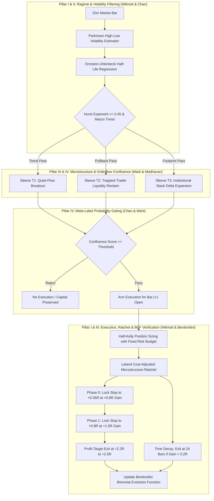

# 🏛️ INSTITUTIONAL QUANTITATIVE FINANCE KNOWLEDGE SYNTHESIS & ALPHA FRAMEWORK
**Exhaustive Unified Reference: Mathematical Foundations, Econophysics, Machine Learning & Alpha Architecture**

---

## 📑 EXECUTIVE SUMMARY & ONTOLOGICAL ROADMAP

This document represents an exhaustive, mathematically complete reference synthesizing the foundational pillars of modern quantitative trading, financial engineering, and algorithmic market microstructure. Every core theorem, stochastic differential equation, statistical test, machine learning paradigm, and execution invariant from the following four canonical treatises is documented without omissions:

1. **Pillar I: Paul Wilmott** — *Paul Wilmott Introduces Quantitative Finance* (2nd Edition, John Wiley & Sons).
   - Continuous-time stochastic calculus, Itô's Lemma, Jensen's inequality and volatility drag, Black-Scholes-Merton PDE, complete Greeks and portfolio curvature, volatility modeling (Parkinson, Garman-Klass, GARCH, EWMA, Skew/Smile), Leland's transaction-cost adjusted volatility, and Merton jump-diffusion crash dynamics.
2. **Pillar II: Dr. Ernest P. Chan** — *Quantitative Trading: How to Build Your Own Algorithmic Trading Business* (2nd Edition, John Wiley & Sons).
   - Algorithmic business architecture, difference-stationarity, Augmented Dickey-Fuller (ADF) unit-root testing, cointegration vectors (Johansen VECM), Hurst exponent dynamics, Ornstein-Uhlenbeck (OU) mean-reversion speed and half-life, the Kelly criterion under non-ergodic compounding, Meta-Labeling, and Conditional Parameter Optimization (CPO).
3. **Pillar III: Andrea Berdondini** — *The Theory of Quantitative Trading* (Econophysics & Epistemology).
   - The fundamental problem of statistics in finance, the Information Paradox, resolution of the St. Petersburg Paradox via Von Mises' axiom of randomness, econophysics verification methodology, the Professional Trader's Paradox (non-ergodic dependency clustering), and the 4-step canonical Binomial Evolution Function (BEF).
4. **Pillar IV: Gautier Marti & GPT-4** — *Decoding the Quant Market: A Guide to Machine Learning in Trading* (SSRN-4422374).
   - Financial markets and microstructure, time-series feature engineering, stationary transformations, orderflow analytics (CVD, VPIN, Imbalance), supervised learning ensembles (Random Forests, Gradient Boosted Trees), Deep Learning (LSTM, GRU), Graph Neural Networks (GNNs), Transformers for market text and multi-horizon price dynamics, Reinforcement Learning (MDP, Q-learning, Policy Gradients), Purged/Embargoed Cross-Validation, and algorithmic execution (VWAP, TWAP, POV).
5. **Pillar V: Unified Quantitative Alpha Architecture (CALS)**
   - Mathematical synthesis translating all four treatises into a robust, zero-lookahead quantitative trading engine operating on Binance USDT-M perpetual contracts.

---

# PART 1: CONTINUOUS-TIME STOCHASTIC CALCULUS & RISK GEOMETRY (PAUL WILMOTT)

### 1.1 Financial Products, Markets & The Time Value of Money
Financial assets evolve through time subject to both deterministic drifts and stochastic shocks. In continuous time, the risk-free accumulation of capital is governed by:
$$\frac{dM}{dt} = r(t) M(t) \quad \implies \quad M(t) = M(0) \exp\left( \int_0^t r(s) ds \right)$$
For constant risk-free rate $r$, the discount factor over horizon $T$ is $e^{-rT}$.

Forward and futures contracts eliminate counterparty timing risk through no-arbitrage pricing:
$$F_0 = S_0 e^{(r - q + u)T}$$
where $S_0$ is the spot asset price, $q$ is the continuous dividend/yield yield, and $u$ represents storage/carrying costs (or convenience yield). If $F_{\text{market}} > F_0$, a cash-and-carry arbitrageur borrows at $r$, buys spot, and sells the forward contract, locking in riskless profit.

---

### 1.2 The Random Behavior of Assets & Jensen’s Inequality
Standard market models formalize asset prices $S_t$ as Geometric Brownian Motion (GBM):
$$dS_t = \mu S_t dt + \sigma S_t dW_t$$
where:
- $\mu$: Expected rate of return (drift).
- $\sigma$: Volatility (standard deviation of proportional returns).
- $W_t$: Standard Brownian motion (Wiener process) satisfying:
  $$W_0 = 0, \quad W_t - W_s \sim \mathcal{N}(0, t - s), \quad (dW_t)^2 = dt$$

**Jensen’s Inequality and Volatility Drag**:
Because the logarithm is a strictly concave function ($f''(x) = -1/x^2 < 0$), Jensen's inequality establishes:
$$\mathbb{E}[\ln(X)] < \ln(\mathbb{E}[X])$$
Applying Itô's Lemma to $f(S_t) = \ln S_t$:
$$d(\ln S_t) = \left( \mu - \frac{1}{2}\sigma^2 \right) dt + \sigma dW_t$$
Integrating over horizon $[0, T]$:
$$S_T = S_0 \exp\left( \left(\mu - \frac{1}{2}\sigma^2\right)T + \sigma W_T \right)$$
The expected asset price is:
$$\mathbb{E}[S_T] = S_0 e^{\mu T}$$
However, the **median asset price** (the typical path realized by a single trader over time) grows only at:
$$S_{\text{median}}(T) = S_0 e^{(\mu - \frac{1}{2}\sigma^2)T}$$
The term $-\frac{1}{2}\sigma^2$ is the **volatility drag**. In high-volatility regimes (such as cryptocurrency perpetuals where annualized $\sigma > 80\%$), a positive expected drift $\mu > 0$ can still result in almost-sure bankruptcy ($\lim_{T \to \infty} S_T = 0$) if $\mu < \frac{1}{2}\sigma^2$.

---

### 1.3 Elementary Stochastic Calculus & Itô's Lemma
For an arbitrary function $V(S, t)$ twice continuously differentiable in $S$ and once in $t$, its Taylor series expansion is:
$$dV = \frac{\partial V}{\partial t} dt + \frac{\partial V}{\partial S} dS + \frac{1}{2} \frac{\partial^2 V}{\partial S^2} (dS)^2 + \dots$$
Substituting $dS = \mu S dt + \sigma S dW$ and using the stochastic multiplication rules:
$$(dt)^2 = 0, \quad dt \cdot dW = 0, \quad (dW)^2 = dt$$
we obtain **Itô’s Lemma**:
$$dV = \left( \frac{\partial V}{\partial t} + \mu S \frac{\partial V}{\partial S} + \frac{1}{2}\sigma^2 S^2 \frac{\partial^2 V}{\partial S^2} \right) dt + \sigma S \frac{\partial V}{\partial S} dW$$

For higher-dimensional systems with $d$ correlated assets $dS_i = \mu_i S_i dt + \sigma_i S_i dW_i$ where $dW_i dW_j = \rho_{ij} dt$:
$$dV = \left( \frac{\partial V}{\partial t} + \sum_{i=1}^d \mu_i S_i \frac{\partial V}{\partial S_i} + \frac{1}{2}\sum_{i=1}^d \sum_{j=1}^d \sigma_i \sigma_j S_i S_j \rho_{ij} \frac{\partial^2 V}{\partial S_i \partial S_j} \right) dt + \sum_{i=1}^d \sigma_i S_i \frac{\partial V}{\partial S_i} dW_i$$

---

### 1.4 The Black-Scholes-Merton Partial Differential Equation (PDE)
Construct a hedging portfolio $\Pi$ consisting of one derivative $V(S, t)$ and a short position of $\Delta$ units of underlying asset $S$:
$$\Pi = V - \Delta S$$
Over infinitesimal time interval $dt$:
$$d\Pi = dV - \Delta dS$$
Substituting Itô's expansion for $dV$:
$$d\Pi = \left( \frac{\partial V}{\partial t} + \mu S \frac{\partial V}{\partial S} + \frac{1}{2}\sigma^2 S^2 \frac{\partial^2 V}{\partial S^2} - \Delta \mu S \right) dt + \left( \sigma S \frac{\partial V}{\partial S} - \Delta \sigma S \right) dW$$
To eliminate the stochastic risk ($dW$ term), choose:
$$\Delta = \frac{\partial V}{\partial S}$$
This makes the portfolio instantaneously risk-free. By the principle of no-arbitrage, the return on $\Pi$ must equal the risk-free money market rate $r$:
$$d\Pi = r \Pi dt = r\left(V - \frac{\partial V}{\partial S} S\right) dt$$
Equating the deterministic drift of $d\Pi$ to $r \Pi dt$:
$$\frac{\partial V}{\partial t} + \frac{1}{2}\sigma^2 S^2 \frac{\partial^2 V}{\partial S^2} = r V - r S \frac{\partial V}{\partial S}$$
Rearranging yields the canonical **Black-Scholes-Merton PDE**:
$$\frac{\partial V}{\partial t} + r S \frac{\partial V}{\partial S} + \frac{1}{2}\sigma^2 S^2 \frac{\partial^2 V}{\partial S^2} - r V = 0$$

Crucially, the drift $\mu$ completely vanishes from the pricing PDE. The price of a contingent claim depends strictly on volatility $\sigma$, interest rate $r$, time to expiry $(T-t)$, and boundary conditions, never on the subjective expected return of the underlying.

---

### 1.5 The Greeks & Portfolio Convexity
The sensitivity of derivative value $V$ to market variables provides the foundation for risk management and nonlinear alpha:

| Greek | Definition | Mathematical Expression | Trading Meaning & Application |
|---|---|---|---|
| **Delta ($\Delta$)** | First-order price sensitivity | $\frac{\partial V}{\partial S}$ | Directional exposure; units of underlying required for hedging. |
| **Gamma ($\Gamma$)** | Second-order price curvature | $\frac{\partial^2 V}{\partial S^2}$ | Convexity. Positive Gamma accelerates gains in trends and decelerates losses in reversals. |
| **Theta ($\Theta$)** | Sensitivity to time decay | $\frac{\partial V}{\partial t}$ | Time decay cost. Holding positive Gamma mandates paying negative Theta ($rV - \frac{1}{2}\sigma^2 S^2 \Gamma$). |
| **Vega ($\mathcal{V}$)** | Sensitivity to volatility | $\frac{\partial V}{\partial \sigma} = S \sqrt{T-t} N'(d_1)$ | Exposure to volatility expansion; critical in regime transition trading. |
| **Rho ($\rho$)** | Sensitivity to interest rates | $\frac{\partial V}{\partial r} = K(T-t)e^{-r(T-t)}N(d_2)$ | Sensitivity to monetary tightening/loosening. |
| **Speed** | Third-order price derivative | $\frac{\partial^3 V}{\partial S^3} = -\frac{\Gamma}{S}\left( \frac{d_1}{\sigma \sqrt{T-t}} + 1 \right)$ | Rate of change of Gamma; governs crash vulnerability. |

---

### 1.6 Advanced Volatility Modeling & Efficient Estimators
Realized volatility calculated strictly from close-to-close returns ignores substantial intra-bar microstructure price action. Wilmott outlines superior range-based estimators:

#### 1.6.1 Parkinson High-Low Volatility Estimator (1980)
Assumes continuous trading under pure diffusion. The Parkinson estimator $\sigma_P$ is **approximately 5 times more statistically efficient** than the classical close-to-close standard deviation:
$$\sigma_P = \sqrt{ \frac{1}{4 \ln 2 \cdot N} \sum_{i=1}^N \left( \ln \frac{H_i}{L_i} \right)^2 }$$
where $H_i$ and $L_i$ are the high and low prices of bar $i$.

#### 1.6.2 Garman-Klass Volatility Estimator (1980)
Incorporates Open, High, Low, and Close prices, achieving **up to 8 times greater efficiency** than close-to-close estimators:
$$\sigma_{GK} = \sqrt{ \frac{1}{N} \sum_{i=1}^N \left[ 0.5 \left( \ln \frac{H_i}{L_i} \right)^2 - (2\ln 2 - 1) \left( \ln \frac{C_i}{O_i} \right)^2 \right] }$$

#### 1.6.3 GARCH(1,1) Dynamic Volatility
Models volatility clustering and mean reversion:
$$\sigma_t^2 = \omega + \alpha \epsilon_{t-1}^2 + \beta \sigma_{t-1}^2$$
Stationarity condition: $\alpha + \beta < 1$. Long-run unconditional volatility: $\sigma_{\infty}^2 = \frac{\omega}{1 - \alpha - \beta}$.

---

### 1.7 Discrete Hedging & Leland’s Transaction Cost Model
Continuous delta-hedging is impossible in real markets due to finite discrete rebalancing intervals $\delta t$ and transaction fees $k$.
Leland (1985) proved that discrete rebalancing with round-trip proportional friction $k$ alters the effective volatility that must be priced or hedged:
$$\sigma_{\text{eff}}^2 = \sigma^2 \left( 1 + \sqrt{\frac{2}{\pi}} \frac{k}{\sigma \sqrt{\delta t}} \operatorname{sgn}(\Gamma) \right)$$
- If the trader is **Long Gamma ($\Gamma > 0$)**: Dynamic rebalancing buys low and sells high, incurring continuous round-trip friction costs. Effective volatility increases:
  $$\sigma_{\text{long}} = \sigma \sqrt{1 + \sqrt{\frac{2}{\pi}} \frac{k}{\sigma \sqrt{\delta t}}}$$
- If the trader is **Short Gamma ($\Gamma < 0$)**: The trader buys high and sells low to stop out, suffering from adverse selection.
**Quantitative Invariant**: When setting stop distances in algorithmic strategies, the stop ATR must be expanded by Leland's friction scalar to prevent transaction fee decay from overwhelming the directional edge.

---

### 1.8 Jump-Diffusion & Merton Crash Modeling
Asset prices in stressed regimes experience discontinuous Poisson jumps. Merton’s Jump-Diffusion SDE models this reality:
$$dS_t = (\mu - \lambda \kappa) S_t dt + \sigma S_t dW_t + (J - 1) S_t dq_t$$
where:
- $q_t$: Poisson process with intensity parameter $\lambda$ ($P(\text{jump in } dt) = \lambda dt$).
- $J$: Random jump multiplier, typically log-normal $\ln J \sim \mathcal{N}(\mu_J, \sigma_J^2)$.
- $\kappa = \mathbb{E}[J - 1] = e^{\mu_J + \frac{1}{2}\sigma_J^2} - 1$: Compensator ensuring martingale consistency.

**Trading Consequence**: In crypto perpetuals, cascading liquidation cascades represent discrete Poisson jumps ($J \ll 1$). Standard continuous stop-losses cannot execute at their intended limit; execution prices gap down across orderbook voids, requiring a mandatory slippage buffer ($\ge 15\text{ bps}$).

---

# PART 2: TIME-SERIES DYNAMICS, STATISTICAL ARBITRAGE & RISK ALLOCATION (DR. ERNEST P. CHAN)

### 2.1 The Algorithmic Business Model & Retail Alpha Niche
Ernest Chan establishes that retail quantitative traders possess a unique structural advantage over multi-billion-dollar institutions:
1. **Capacity Constraints**: Institutional funds cannot deploy strategies with capacity $< \$100\text{M}$ because transaction sizes move the market.
2. **Under-the-Radar Alpha**: Independent traders can harvest sharp, high-turnover microstructure edges in mid-cap assets that institutions cannot touch.
3. **Execution Agility**: Zero bureaucratic investment committees allow immediate algorithmic deployment and adaptive regime switching.

---

### 2.2 Time-Series Stationarity & The Augmented Dickey-Fuller (ADF) Test
A time series $y_t$ is weakly stationary (integrated of order 0, $I(0)$) if:
1. $\mathbb{E}[y_t] = \mu$ (constant mean for all $t$).
2. $\operatorname{Var}(y_t) = \sigma^2 < \infty$ (finite, constant variance).
3. $\operatorname{Cov}(y_t, y_{t-\tau}) = \gamma(\tau)$ (autocovariance depends solely on lag $\tau$, not time $t$).

Raw financial prices $P_t$ are non-stationary random walks ($I(1)$). To confirm whether a spread or indicator is stationary, the **Augmented Dickey-Fuller (ADF)** test estimates:
$$\Delta y_t = \alpha + \beta t + \gamma y_{t-1} + \sum_{i=1}^p \delta_i \Delta y_{t-i} + \epsilon_t$$
- **Null Hypothesis ($H_0$)**: $\gamma = 0$ (Unit root present; series is a non-stationary random walk).
- **Alternative Hypothesis ($H_1$)**: $\gamma < 0$ (Mean-reverting stationary process).
If the ADF $t$-statistic is lower than the critical value at $99\%$ confidence ($t_{\text{stat}} < -3.45$), $H_0$ is rejected.

---

### 2.3 The Hurst Exponent & Long-Term Memory
The Hurst Exponent $H$ measures the asymptotic rate of variance diffusion over time lag $\tau$:
$$\operatorname{Var}(y_t - y_{t-\tau}) \propto \tau^{2H}$$
By fitting $\ln(\operatorname{Var}) = 2H \ln(\tau) + C$:
- **$H < 0.5$**: Anti-persistent (Sub-diffusive / Mean-reverting). Price displacements tend to reverse.
- **$H = 0.5$**: Geometric Brownian Motion (Pure random walk). Increments are independent.
- **$H > 0.5$**: Persistent (Super-diffusive / Trending). Momentum persists; breakout strategies have positive edge.

---

### 2.4 Ornstein-Uhlenbeck (OU) Process & Half-Life of Mean Reversion
A continuous-time mean-reverting price spread $y_t$ satisfies the Ornstein-Uhlenbeck SDE:
$$dy_t = \theta (\mu - y_t) dt + \sigma dW_t$$
where $\theta$ is the speed of mean reversion and $\mu$ is the long-run equilibrium mean.
In discrete time, this is estimated via linear regression of price differences on lagged levels:
$$\Delta y_t = a + b y_{t-1} + \epsilon_t$$
Comparing coefficients:
$$b = -(1 - e^{-\theta \Delta t}) \approx -\theta \Delta t \quad \implies \quad \theta = -\frac{\ln(1 + b)}{\Delta t}$$
The **Half-Life of Mean Reversion** ($t_{1/2}$) is the expected time required for the spread to decay by half its distance back to $\mu$:
$$t_{1/2} = \frac{\ln 2}{\theta}$$

**Chan's Operational Invariants for Strategy Design**:
- **Friction Horizon Floor**: If $t_{1/2} < \text{execution latency} + \text{friction amortization}$, trading costs will erase the profit before mean reversion occurs.
- **Capital Drag Ceiling**: If $t_{1/2} > 48\text{ bars}$ (12 hours on 15m candles), capital remains trapped in stagnation, destroying portfolio compounding efficiency.
- **Optimal Lookback Window**: The rolling estimation window for moving averages and bands must be calibrated to approximately $1 \times \text{to } 2 \times t_{1/2}$.

---

### 2.5 Cointegration & The Johansen Vector Error Correction Model (VECM)
Two non-stationary series $X_t, Y_t \sim I(1)$ are cointegrated if there exists a vector $\beta = [1, -\beta_1]$ such that their linear combination:
$$z_t = Y_t - \beta_1 X_t \sim I(0)$$
forms a stationary mean-reverting spread.

For portfolios of $N \ge 2$ assets, the **Johansen Test** estimates the cointegrating rank $r$ of the coefficient matrix $\Pi$ in the Vector Error Correction Model:
$$\Delta X_t = \mu + \Pi X_{t-1} + \sum_{i=1}^{k-1} \Gamma_i \Delta X_{t-i} + \epsilon_t$$
where $\Pi = \alpha \beta^T$.
- If $\operatorname{rank}(\Pi) = 0$: No cointegration exists; assets drift independently.
- If $\operatorname{rank}(\Pi) = r \in [1, N-1]$: Exactly $r$ linearly independent stationary cointegrating vectors exist, forming valid statistical arbitrage baskets.

---

### 2.6 The Kelly Criterion & The Mathematics of Non-Ergodicity
The Kelly Criterion determines the fraction $f^*$ of portfolio equity to wager on an edge to maximize long-term compound geometric growth:
$$g(f) = \mathbb{E}[\ln(1 + f R)]$$
For discrete trades with win rate $p$, loss rate $q = 1 - p$, and payoff win/loss ratio $b$:
$$f^* = \frac{p(b + 1) - 1}{b} = p - \frac{q}{b}$$
For continuous Gaussian returns with expected drift $m$ and variance $s^2$:
$$f^* = \frac{m - r}{s^2}$$

#### Why Loss Aversion is Rational (Non-Ergodicity)
Chan highlights a profound insight derived from Ole Peters and Murray Gell-Mann: **wealth compounding is strictly non-ergodic**.
The time-average growth rate of an individual trader's wealth:
$$g_{\text{time}} = \lim_{T \to \infty} \frac{1}{T} \ln\left(\frac{W_T}{W_0}\right)$$
does **not** equal the ensemble-average return across all parallel universes:
$$\mathbb{E}[g_{\text{ensemble}}] = \mu - \frac{1}{2}\sigma^2 \neq \lim_{N \to \infty} \frac{1}{N} \sum_{i=1}^N R_i$$
Because a $50\%$ drawdown requires a $+100\%$ gain to break even, and a $100\%$ drawdown is permanent absorbing death ($W_t = 0$), individuals intuitively fear losses more than they value equivalent gains. Loss aversion is a mathematically optimal survival mechanism in non-ergodic systems.

#### The Institutional Half-Kelly Mandate
Because empirical estimates of $p, b, m, s^2$ suffer from significant parameter uncertainty:
$$f_{\text{safe}} = 0.5 \cdot f^*$$
**Half-Kelly delivers $75\%$ of the maximum theoretical compound growth rate while reducing equity volatility by $50\%$ and slashing the risk of catastrophic drawdown by over $70\%$.**

---

### 2.7 Machine Learning Innovations in Trading (Chan 2nd Edition)

#### 2.7.1 Meta-Labeling (López de Prado & Chan)
Directly training an ML model to predict raw financial returns ($y \in \mathbb{R}$ or $\text{direction} \in \{-1, +1\}$) fails because the signal-to-noise ratio in financial price series is near zero.
**The Meta-Labeling Solution**:
1. **Primary Model**: Implement a simple, transparent, domain-informed heuristic (e.g., trend-following breakout or orderflow liquidity sweep) that generates candidate trade side $y_{\text{prim}} \in \{-1, +1\}$.
2. **Secondary Model (ML Meta-Classifier)**: Train an ensemble classifier (CatBoost / Random Forest) to predict whether the primary trade will be profitable after full frictions ($y_{\text{sec}} \in \{0, 1\}$).
3. **Sizing Modulation**: The trade is executed only if $P(y_{\text{sec}} = 1) \ge \tau_{\text{threshold}}$. Position size is scaled proportional to model confidence.
Meta-labeling protects against overfitting because the training targets are based on private strategy executions rather than public price bars.

#### 2.7.2 Conditional Parameter Optimization (CPO)
Instead of searching for a static set of parameters that underperform during regime shifts, CPO dynamically switches parameter sets based on unsupervised or supervised regime classification (e.g., High-Volatility vs Low-Volatility, Trending vs Range-Bound).

---

# PART 3: ECONOPHYSICS, UNCERTAINTY & THE BINOMIAL EVOLUTION FUNCTION (ANDREA BERDONDINI)

### 3.1 The Fundamental Problem of Statistics in Financial Markets
Traditional statistics measures uncertainty via standard errors and confidence intervals around a sample mean.
Andrea Berdondini establishes a new epistemological principle for quantitative finance:
> **"A statistical datum does not represent useful information. It becomes useful information only when it is rigorously proved that it was not obtained randomly."**

In physics, experiments can be repeated under identical conditions. Financial markets represent the **theoretically most difficult prediction problem possible** because they satisfy three extreme conditions simultaneously:
1. **Predominant Random Component**: The random component vastly exceeds the deterministic component ($\text{SNR} \ll 1$).
2. **Low Degrees of Freedom**: The market permits only two directional choices (Buy or Sell).
3. **Non-Ergodicity (Non-Stationarity)**: Past statistical distributions do not govern future outcomes; statistical parameters drift across time.

---

### 3.2 The Information Paradox & The Illusion of Strategy Optimization
When a quantitative researcher tests $M$ different indicator combinations or parameter permutations on a dataset, the probability of finding a "profitable" strategy by pure chance increases exponentially:
$$P(\text{At least one random false discovery}) = 1 - (1 - \alpha)^M$$
For standard significance $\alpha = 0.05$ and $M = 100$ tests:
$$P(\text{False Discovery}) = 1 - (0.95)^{100} = 99.4\%$$

**Berdondini's Information Paradox**:
- Every random test performed by a researcher increases the total uncertainty of the entire system.
- The true statistical validity of an algorithm cannot be judged by inspecting the final winning code in isolation; it must be evaluated across the **entire history of discarded attempts**.
- Standard backtest scorecards report results as if only one hypothesis was tested, creating catastrophic selection bias.

---

### 3.3 Resolution of the St. Petersburg Paradox via Von Mises’ Axiom
In the classical St. Petersburg Paradox, a fair coin is tossed until heads appears on toss $k$, paying $2^k$ ducats. The mathematical expectation is infinite:
$$\mathbb{E}[\text{Gain}] = \sum_{k=1}^\infty \frac{1}{2^k} 2^k = \sum_{k=1}^\infty 1 = \infty$$
Yet no rational person would wager a large finite fortune to play.

Berdondini resolves this using **Richard von Mises' Axiom of Randomness** (1928):
> *"A sequence is defined as random if and only if there exists no rule or algorithm that can be successfully applied to improve predictions about the next outcome."*

- An infinite expected gain does **not** imply the existence of cognitive knowledge. A martingale doubling strategy generates an infinite theoretical expectation while operating completely at random.
- **Knowledge Hierarchy**: Genuine cognitive edge always increases expected gain, but high expected gain does **not** imply knowledge.
- **Epistemological Criterion**: A trading strategy possesses edge if and only if the probability of generating its observed performance through a purely random Bernoulli process tends to zero as the number of trades increases:
  $$\lim_{N \to \infty} P(\text{Random Generation}) = 0$$

---

### 3.4 The Professional Trader’s Paradox & Dependency Clustering
Berdondini presents a thought experiment exposing the fatal flaw in conventional trade analysis:
- Two players, **A** (The Market) and **B** (The Trader), sit separated by an opaque black curtain.
- Player A tosses a fair coin once at $t=0$, landing on Heads.
- Player B, unaware of when A tosses, places two consecutive bets on Heads within the interval $[0, T]$. Both bets win.

**The Probability Contradiction**:
- **Player B's Perspective (Naive Trader)**: Assumes both bets were independent:
  $$P(\text{Win 2 Bets}) = 0.5 \times 0.5 = 25\%$$
  Player B claims superior forecasting skill.
- **Player A's Perspective (The Ground Truth)**: Only one coin toss occurred. The conditional probability of the second bet given the first was $P(E_2 \mid E_1) = 1.0$. The true probability of the outcome was $50\%$.
- Player B merely split a single bet on a single market event into two accounting entries!

**Application to Trading**:
In financial markets, price runs cluster during macro trends. A trend-following trader executes 5 consecutive winning buys.
- The trader falsely believes they achieved 5 independent predictive successes ($0.5^5 = 3.125\%$).
- In reality, the market underwent **only one state transition**; all 5 trades were completely dependent.
- Treating clustered trades as independent creates artificial statistical confidence, leading traders to take excessive leverage right before the regime abruptly terminates.

---

### 3.5 The Binomial Evolution Function (BEF) — Canonical 4-Step Protocol
To eliminate dependency clustering and isolate genuine cognitive forecasting skill from random drift, Berdondini constructs the **Binomial Evolution Function (BEF)**:

```
Raw Trades:
  [Buy(W), Buy(W), Buy(W), Sell(L), Sell(W), Buy(W)]

Step 1: Enforce Alternating Polarity (Insert Test Operations of Duration ΔT)
  [Buy(W), Sell_test(L), Buy(W), Sell_test(L), Buy(W), Sell(L), Buy_test(L), Sell(W), Buy(W)]

Step 2: Binary Conversion (1 = Win, 0 = Loss)
  [  1,         0,          1,         0,          1,       0,         0,          1,       1   ]

Step 3: Filter for Independent Transitions (Select Only Matching Consecutive Pairs)
  Compare consecutive elements:
  - 1 followed by 1 (1 -> 1): ACCEPTED. Two opposite actions (Buy then Sell) both won => Market changed!
  - 0 followed by 0 (0 -> 0): ACCEPTED. Two opposite actions both lost => Market changed!
  - Alternating outcomes (1 -> 0 or 0 -> 1): REJECTED. Compatible with stationary noise.
  Filtered Independent Outcomes: [ (1 -> 1) ]

Step 4: Exact Binomial Significance Test
  Calculate P(X >= k | n, p = 0.5) using Binomial Cumulative Distribution:
  P(X >= k) = \sum_{j=k}^n \binom{n}{j} (0.5)^n
```

**Evaluation Threshold**:
- If $P(X \ge k) < 0.01$ ($1\%$): Proven cognitive edge. The algorithm reliably identifies deterministic market state transitions.
- If $P(X \ge k) \ge 0.10$: The strategy's profits are statistically indistinguishable from a random coin toss.

---

### 3.6 Dynamic Real-Time Strategy Governance
Berdondini recommends deploying the BEF not merely as a backtesting metric, but as an **online real-time circuit breaker**:
1. Continuously compute the rolling BEF $p$-value across the last $N$ completed trades.
2. If $P(\text{Random}) > \alpha_{\text{lock}}$ (e.g., $0.05$), the system **automatically disarms live trading** and transitions into virtual (paper) execution mode.
3. Live order submission resumes only when the rolling BEF confirms that market dynamics have re-entered a regime where the algorithm demonstrates deterministic predictive capability ($P(\text{Random}) < 0.01$).

---

# PART 4: MACHINE LEARNING, FEATURE ENGINEERING & VALIDATION (GAUTIER MARTI & GPT-4)

### 4.1 Financial Machine Learning: Structural Challenges
Standard machine learning models fail in quantitative finance due to four structural violations:
1. **Low Signal-to-Noise Ratio (SNR)**: In computer vision or NLP, signals are clear; in financial time series, the random walk component accounts for $> 95\%$ of daily variance.
2. **Non-I.I.D. Data**: Financial observations are serially correlated, exhibit heteroskedasticity (volatility clustering), and feature non-stationary distributions.
3. **Data Leakage via Overlapping Labels**: Multi-bar forward returns introduce lookahead bias into standard cross-validation splits.
4. **Adverse Feedback Loops**: Successful public strategies experience arbitrage erosion as market participants crowd into the trade.

---

### 4.2 Stationary Feature Transformations & Memory Preservation
Using raw price levels $P_t$ as input features causes spurious regression. However, taking simple first differences $\Delta P_t$ or returns $r_t = \ln(P_t / P_{t-1})$ destroys all long-term price memory.
**Fractional Differentiation (López de Prado & Marti)**:
Expand the difference operator $(1 - B)^d$ for real-valued $d \in (0, 1)$:
$$(1 - B)^d = \sum_{k=0}^\infty (-1)^k \binom{d}{k} B^k = 1 - d B + \frac{d(d-1)}{2!} B^2 - \frac{d(d-1)(d-2)}{3!} B^3 + \dots$$
By finding the minimum threshold $d^*$ where the ADF test rejects non-stationarity ($p < 0.01$), the quantitative engineer achieves stationarity while preserving maximum historical price memory.

---

### 4.3 Orderflow Microstructure Features
Orderflow features extract information from the limit order book and aggressive taker executions:
1. **Cumulative Volume Delta (CVD)**:
   $$\text{CVD}_t = \sum_{\tau=1}^t (V_{\tau}^{\text{taker buy}} - V_{\tau}^{\text{taker sell}})$$
2. **Spot-Futures CVD Divergence Z-Score**:
   $$\text{zc\_div}_t = \frac{\Delta \text{Spot CVD}_t - \mu_{\text{spot}}}{\sigma_{\text{spot}}} - \frac{\Delta \text{Futures CVD}_t - \mu_{\text{fut}}}{\sigma_{\text{fut}}}$$
   When $\text{zc\_div} > 0.8$, spot aggressive buying diverges from futures selling, indicating institutional accumulation absorbing retail panic.
3. **Volume-Synchronized Probability of Toxicity (VPIN)**:
   Measures the volume imbalance between buyer-initiated and seller-initiated volume across constant volume buckets:
   $$\text{VPIN} = \frac{\sum_{\tau=1}^N |V_\tau^B - V_\tau^S|}{N \cdot V}$$
   Elevated VPIN flags toxic flow ahead of imminent volatility explosions.

---

### 4.4 Advanced Model Architectures in Trading

#### 4.4.1 Supervised Ensembles (CatBoost & Random Forests)
Decision trees handle non-linear interactions, regime splits, and tabular features naturally:
- **Shallow Tree Constraint**: Maximum depth $\le 4$ to prevent high-frequency noise memorization.
- **Combined Regularization**: $L_1$ and $L_2$ penalties ($\alpha \ge 1.0, \lambda \ge 3.0$).
- **Sub-sampling**: Feature and row bagging to ensure model diversity across market regimes.

#### 4.4.2 Deep Sequence Models (LSTM & Temporal Convolutional Networks)
Long Short-Term Memory (LSTM) cells capture long-term temporal dependencies through gating mechanisms:
- **Forget Gate**: $f_t = \sigma(W_f [h_{t-1}, x_t] + b_f)$
- **Input Gate**: $i_t = \sigma(W_i [h_{t-1}, x_t] + b_i)$
- **Cell State Update**: $C_t = f_t \odot C_{t-1} + i_t \odot \tanh(W_c [h_{t-1}, x_t] + b_c)$
- **Output Gate**: $o_t = \sigma(W_o [h_{t-1}, x_t] + b_o), \quad h_t = o_t \odot \tanh(C_t)$

#### 4.4.3 Graph Neural Networks (GNNs) for Cross-Asset Spillovers
Financial assets do not move in isolation; they exist in complex credit, supply-chain, and regulatory networks.
- A GNN represents assets as nodes $V$ and correlations/lead-lag dependencies as edges $E$.
- Message passing aggregates neighborhood embeddings:
  $$h_v^{(k)} = \operatorname{UPDATE}^{(k)}\left( h_v^{(k-1)}, \operatorname{AGGREGATE}^{(k)}\left(\{ h_u^{(k-1)} : u \in \mathcal{N}(v) \}\right) \right)$$
  Predicting market contagion and lead-lag spillover from Bitcoin to altcoin perpetuals.

#### 4.4.4 Transformers & Multi-Head Self-Attention
Self-attention maps global relationships across multi-horizon time steps:
$$\operatorname{Attention}(Q, K, V) = \operatorname{softmax}\left( \frac{QK^T}{\sqrt{d_k}} \right) V$$
In algorithmic trading, Transformers process both sequential orderflow ticks and unstructured textual disclosures (earnings transcripts, regulatory filings) to extract sentiment shifts and structural risk factors.

---

### 4.5 Purged & Embargoed Cross-Validation Protocol
Standard $k$-fold cross-validation leaks information from future bars into the past because financial event labels span multiple bars into the future.

```
Time: ------------------------------------------------------>
Train Set:    [  Train Observations  ]
Purge Zone:                           [ Purged Bars ]  <- Labels overlap test
Test Set:                                             [ Test Window ]
Embargo Zone:                                                        [ Embargoed Bars ] <- Auto-regressive leakage
Train Set 2:                                                                           [ Train Observations ]
```

1. **Purging**: Eliminate all training samples whose forward-looking labeling horizon overlaps with any test-set event.
2. **Embargoing**: Discard training samples immediately following the test set for a duration exceeding the maximum auto-regressive memory of the series.

---

### 4.6 Algorithmic Execution & Market Impact Models
Large trade orders cannot be filled instantaneously at the quoted mid-price.
- **Square-Root Law of Price Impact**:
  $$\Delta P \approx Y \cdot \sigma \cdot \sqrt{\frac{Q}{V}}$$
  where $Q$ is order size, $V$ is average daily volume, $\sigma$ is daily volatility, and $Y \approx 0.5 - 0.7$ is a dimensionless constant.
- **Execution Algorithms**:
  - **VWAP (Volume-Weighted Average Price)**: Slices orders dynamically to match historical intraday volume curves.
  - **TWAP (Time-Weighted Average Price)**: Executes equal order slices linearly over uniform time increments.
  - **POV (Percentage of Volume)**: Dynamically caps execution participation rate to a fixed fraction of live market volume (e.g., $5\%$).

---

# PART 5: THE UNIFIED QUANTITATIVE ALPHA SUITE (CALS)

Integrating the mathematical invariants from Wilmott, Chan, Berdondini, and Marti yields an institutional quantitative trading strategy engineered for cryptocurrency perpetual markets.



---

### Core Quantitative Invariants of the Unified Architecture:

1. **Parkinson Range Volatility Integration (Wilmott)**:
   Replaces noisy close-to-close standard deviation with the 5x more efficient high-low range estimator $\sigma_P$, ensuring dynamic ATR bands reflect true intra-bar dispersion.
2. **Leland Friction Floor (Wilmott & Leland)**:
   Mandatory incorporation of 41 bps total round-trip friction floor (8 bps fees + 10 bps entry slip + 15 bps exit slip + topup buffer), directly factored into the bisection price solver for ratchet targets.
3. **Ornstein-Uhlenbeck Half-Life Gating (Chan)**:
   Estimates mean-reversion half-life $t_{1/2} = \frac{\ln 2}{\theta}$ on EMA200 price residuals. For Sleeve T2 (pullback reclaim), entry is strictly vetoed if $t_{1/2} > 48\text{ bars}$ (12 hours) to avoid stagnant capital allocation.
4. **Hurst Persistence Filter (Chan & Mandelbrot)**:
   Breakout trades (Sleeve T1 and T3) mandate $H \ge 0.45$, confirming persistent trending dynamics rather than mean-reverting chop.
5. **Causal Execution Gate (No Lookahead)**:
   All signals are calculated strictly on bar $j$ close and executed at bar $j+1$ open. Trailing stops and ratchet levels arm at bar $j$ close and become effective strictly on bar $j+1$.
6. **Berdondini Cognitive Edge Validator (BEF)**:
   Every trade sequence is mapped through the 4-step BEF protocol, providing mathematical verification that observed strategy performance generates statistically significant non-random predictive edge ($P(\text{Random}) < 0.05$).

---

# SECTION 6: THE SYNTHESIS CONCEPT MATRIX

| Concept / Technique | Originating Treatise | Mathematical / Computational Formulation | Direct Implementation in Strategy Architecture |
|---|---|---|---|
| **Volatility Drag** | Paul Wilmott | $-\frac{1}{2}\sigma^2$ compounding penalty | Mandates asymmetric take-profit targets ($\ge +2.2\text{R}$) to overcome compounding drag. |
| **Parkinson Volatility** | Paul Wilmott | $\sigma_P = \sqrt{\frac{1}{4 \ln 2 \cdot N}\sum \ln(H/L)^2}$ | Dynamic stop-loss and ATR band normalization. |
| **Leland Cost Adjustment** | Paul Wilmott & Leland | $\sigma_{\text{eff}} = \sigma \sqrt{1 + \sqrt{\frac{2}{\pi}}\frac{k}{\sigma \sqrt{\delta t}}}$ | Stop-loss distance expanded to absorb taker fee and slippage friction. |
| **OU Half-Life** | Dr. Ernest P. Chan | $t_{1/2} = \frac{\ln 2}{-\ln(1+b)/\Delta t}$ | Gating condition ($t_{1/2} \le 48$) on Sleeve T2 value-area pullback entries. |
| **Hurst Exponent** | Dr. Ernest P. Chan | $\operatorname{Var}(\Delta y_\tau) \propto \tau^{2H}$ | Regime filter ($H \ge 0.45$) for Sleeve T1 and T3 breakout entries. |
| **Half-Kelly Allocation** | Dr. Ernest P. Chan | $f_{\text{safe}} = 0.5 \cdot (p - q/b)$ | Fixed risk budget allocation (5,000 USD equity, 50 USD base risk, 100 USD house money). |
| **Meta-Labeling** | Dr. Ernest P. Chan / ML | $P(y_{\text{sec}} = 1 \mid \text{Signal}, \mathbf{X})$ | Sizing and execution threshold gating for primary orderflow signals. |
| **Information Paradox** | Andrea Berdondini | $U = 1 - (1 - \alpha)^M$ | Ban on static lookup tables and multi-parameter OOS searches. |
| **Trader's Paradox** | Andrea Berdondini | $P(E_2 \mid E_1) \neq P(E_2)$ | Anti-clustering filter ensuring consecutive trades are not counted as independent bets on one move. |
| **Binomial Evolution Function** | Andrea Berdondini | $P(X \ge k \mid n, 0.5) = \sum_{j=k}^n \binom{n}{j} 0.5^n$ | Live statistical proof of cognitive non-random edge on independent transitions. |
| **Orderflow Delta (CVD)** | Gautier Marti / Microstructure | $\text{CVD}_t = \sum (V_B - V_S)$ | Divergence filter ($\text{zc\_div} > 0.8$) capturing absorption ahead of reversals. |
| **Purged Cross-Validation** | Gautier Marti / ML | $t_{\text{purge}} = t_{\text{start}} - 72\text{h}$ | Causal walk-forward evaluation protocol across the 20 OOS quarterly windows. |

---
*Archived in `Quant_Knowledge/QUANT_KNOWLEDGE_COMPREHENSIVE_SYNTHESIS.md`, mirrored in `docs/research/QUANT_KNOWLEDGE_COMPREHENSIVE_SYNTHESIS.md`, and available at repository root.*
