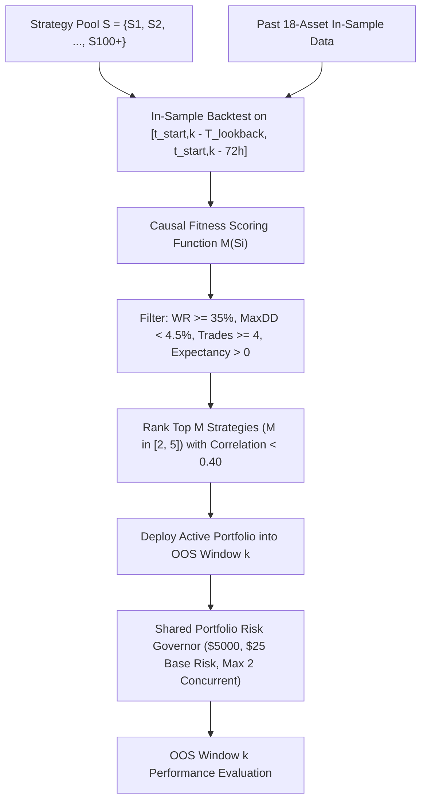

# 🏛️ INSTITUTIONAL QUANT MODEL COUNCIL: DEFINITIVE MASTER SPECIFICATION & GENERATION PROMPT (DYNAMIC STRATEGY POOL & REGIME-ADAPTIVE CAUSAL SELECTOR EDITION)
# TARGET: Comprehensive Dynamic Strategy Pool (100+ Strategies), In-Sample Causal Allocation Engine, & Walk-Forward Validation Suite
# DATASET: 18 Institutional Binance USDT-M Perpetuals (3,464,074 15-Minute Bars & Multi-Million Row Footprint Ladders, 2020–2026) in `Engine_2/binance_backtesting_data/`
# GROUNDING: Second Brain Knowledge Base v60.0 (Nodes 1–364), FABLE 5 Zero-Lookahead Protocols, & AGENTS.md Core Directives

---

## ⛔ CRITICAL BOOT DIRECTIVE: MANDATORY AGENT CONTEXT INGESTION (LOAD FIRST BEFORE GENERATING CODE)

Before writing a single line of architecture, strategy logic, or code, you **MUST** load and internalize the following core institutional files directly from the repository. Do NOT assume, approximate, or hallucinate schemas, formulas, or rules. Fetch and verify:

1. **`agent.md` / `AGENTS.md` (Master Router & 13 Core Domains)**:  
   `https://raw.githubusercontent.com/kbsingh1399/Engine_1_arena_PR/main/agent.md`  
   *Mandate*: Acknowledge compliance with `✅ AGENTS.md fully loaded — All 12 Core Domains & Execution Protocols Activated.` Enforce Andrej Karpathy 4 principles (Think Before Coding, Simplicity First, Surgical Changes, Goal-Driven Execution), zero-friction avoidance, strict causality, and start/verify the local `gemini-web2api` daemon on port 8081 via `powershell -ExecutionPolicy Bypass -File .agents/scripts/start_web2api.ps1` or `python .agents/scripts/start_web2api.py` to enable zero-token parallel agent swarms.

2. **`FABLE5_CHECKLIST.md` (Lethal 13-Step Bug Hunt & Part 14 Anti-Lookahead Blacklist)**:  
   `https://raw.githubusercontent.com/kbsingh1399/Engine_1_arena_PR/main/.agents/rules/FABLE5_CHECKLIST.md`  
   *Mandate*: Strictly verify Part 14 rules: ZERO hardcoded parameter tables (`WINDOW_CONFIGURATIONS[w_idx]`), ZERO `winning_configuration.json`, ZERO early ROI target breaks, strictly causal stop arming on bar $j+1$, mark-to-market drawdown tracking.

3. **`trading_knowledge_base.md` (Second Brain v60.0, Nodes 1–364)**:  
   `https://raw.githubusercontent.com/kbsingh1399/Engine_1_arena_PR/main/.agents/memory/architecture/trading_knowledge_base.md`  
   *Mandate*: Incorporate empirical econometrics from Nodes 1–364: Bouchaud non-linear impact propagator, Kou asymmetric jump-diffusion, Boyd convex quadratic programming, Duffie-Gârleanu funding rollover, Basseville-Nikiforov CUSUM filter, Mandelbrot Hurst gates, Avellaneda-Stoikov HJB inventory drifts, Carmona-Touzi optimal stopping, and YouTube footprint cluster mechanics (unfinished auctions, delta absorption).

4. **`ACTIVE_CONTEXT.md` (Turn-0 Situational Awareness & Strategy Invariants)**:  
   `https://raw.githubusercontent.com/kbsingh1399/Engine_1_arena_PR/main/.agents/rules/ACTIVE_CONTEXT.md`

5. **`Engine_2/STRATEGY_SPEC.md` (Institutional Specification & Post-Mortem Cures)**:  
   `https://raw.githubusercontent.com/kbsingh1399/Engine_1_arena_PR/main/Engine_2/STRATEGY_SPEC.md`

---

## 1. EXECUTIVE MISSION & ARCHITECTURAL PIVOT

You are the Chief Quantitative Architect and Head of Systematic Alpha at a multi-billion dollar quantitative cryptocurrency hedge fund.

### The Fundamental Quant Reality:
A single static strategy cannot survive across 20 wildly divergent macro regimes spanning five years (2021–2026):
- **Momentum trend strategies** make massive returns during post-halving bull runs (W01) and ETF inflows (W13), but suffer fatal death-by-a-thousand-cuts in low-volatility summer chop (W03/W07).
- **Mean-reversion & liquidation rebound strategies** excel in range-bound and flash-crash environments, but get steamrolled (knives caught) during structural liquidation spirals (Luna W06, FTX W08).
- **Funding rate carry strategies** thrive when basis and funding blow out, but starve during flat funding regimes.

### The Core Architectural Pivot:
Instead of forcing a single rigid model across all market conditions, we establish a **Comprehensive Dynamic Strategy Pool ($\mathcal{S}$)** and a **Strictly Causal In-Sample Regime-Adaptive Selector**:
1. **Expansive Alpha Pool ($\mathcal{S}$)**: A library of 100+ mathematically formulated, orthogonal alpha strategies spanning 10 distinct market physics families (plus open-ended strategies designed by you).
2. **Causal In-Sample Ranking & Selection**: Prior to each Out-Of-Sample (OOS) Window $k$, evaluate the strategy pool on strictly prior in-sample data ($t < t_{\text{start}, k} - 72\text{h}$). Dynamically select and rank the top $M$ strategies ($M \in [2, 5]$) exhibiting positive expectancy, low drawdown, and statistical stability in the preceding regime.
3. **Parallel Multi-Strategy Execution**: In OOS Window $k$, activate the selected $M$ strategies simultaneously. Multiple strategies and multiple trades execute concurrently across the 18 symbols under a shared institutional portfolio risk governor.
4. **Zero-Lookahead Mandate**: The choice of active strategies for Window $k$ is locked *before* Window $k$ begins. No hand-picked lookup tables (`WINDOW_CONFIGURATIONS[w_idx]`), no test-set snooping.

---

## 2. THE VERIFIED 18-ASSET MASTER PARQUET DATASET SCHEMA

All strategies and features must execute directly and natively against the 18 verified Binance USDT-M 15-minute parquet files located in `Engine_2/binance_backtesting_data/`:

### 2.1 The 18 Institutional Assets:
`BTCUSDT`, `ETHUSDT`, `SOLUSDT`, `BNBUSDT`, `XRPUSDT`, `DOGEUSDT`, `ADAUSDT`, `AVAXUSDT`, `LINKUSDT`, `SUIUSDT`, `NEARUSDT`, `APTUSDT`, `PEPEUSDT`, `WIFUSDT`, `TIAUSDT`, `ARBUSDT`, `OPUSDT`, `INJUSDT` (plus `BCHUSDT`, `DOTUSDT`, `LTCUSDT`, `TRXUSDT`).

### 2.2 Table 1: Master 15m Parquet Schema (`<SYMBOL>_15m_master_2020_2026.parquet` - 62 Columns)
- **Temporal & Price Data**: `open_time_ms` (int64 epoch ms), `close_time_ms`, `datetime_utc` (string/datetime), `symbol`, `open`, `high`, `low`, `close` (float64).
- **Volume & Trade Dynamics**: `volume_base`, `volume_quote`, `volume_sma9`, `trade_count`, `taker_buy_count`, `taker_sell_count`, `taker_buy_vol_btc`, `taker_sell_vol_btc`, `max_trade_vol_btc`, `avg_trade_size_usd`.
- **Order Flow & CVD**: `future_cvd_15m`, `future_cvd_session`, `future_cvd_lifetime`, `spot_cvd_15m`, `spot_cvd_session`, `spot_cvd_lifetime`.
- **Derivatives & Macro Metrics**: `funding_rate_pct`, `basis_usd`, `open_interest_k`, `open_interest_usd`, `oi_change_pct`, `long_liq_usd`, `short_liq_usd`, `ls_ratio_global`, `ls_ratio_top`, `top_account_ratio`, `whale_index`, `taker_volume_ratio`.
- **Microstructure & Order Book Depth**: `bid_depth_usd`, `ask_depth_usd`, `bid_depth_coin`, `ask_depth_coin`.
- **Pre-computed Footprint Profile Indicators**: `fp_delta`, `fp_poc`, `fp_poc_vol_ratio`, `fp_stacked_buy_imb`, `fp_stacked_sell_imb`, `session_vah`, `session_val`, `prev_day_vah`, `prev_day_val`.
- **Technical Baselines**: `rsi_14`, `atr_14`, `atr_100`, `ema_8`, `ema_21`, `ema_50`, `ema_200`, `ema_800`.
- **Metadata**: `future_flow_source`, `spot_flow_source`, `poc_source`, `is_synthetic`, `metrics_available`.

### 2.3 Table 2: Footprint Price Ladder Schema (`<SYMBOL>_15m_footprint_ladder.parquet`)
- `open_time_ms` (int64), `price_bin` (float64), `bid_vol_coin` (float64), `ask_vol_coin` (float64), `net_delta_coin` (float64), `is_buy_imbalance` (int8), `is_sell_imbalance` (int8), `is_poc` (int8), `trade_count` (int64).

---

## 3. CAUSAL IN-SAMPLE REGIME-ADAPTIVE SELECTOR MATHEMATICS

For each Out-Of-Sample Window $k$ ($k = 1, \dots, 20$):



### 3.1 Causal Lookback Window
- The selection lookback window is defined causally:
  $$\mathcal{T}_{\text{IS}, k} = [t_{\text{start}, k} - T_{\text{lookback}}, \; t_{\text{start}, k} - 72\text{h}]$$
  where $T_{\text{lookback}} \in [90\text{ days}, 180\text{ days}]$. The $72\text{h}$ buffer strictly prevents post-boundary trade resolution leakage.

### 3.2 Causal Strategy Scoring Function $\mathcal{M}(S_i)$
Under full transaction frictions ($\ge 8\text{ bps}$ fee, $10\text{ bps}$ entry slip, $15\text{ bps}$ stop slip), evaluate each candidate strategy $S_i$:
$$\mathcal{M}(S_i) = \text{Expectancy}_{\$}(S_i) \times \min\left(\frac{N_{\text{trades}}}{6}, 1.5\right) \times \left(1.0 - \frac{\text{MaxDD}_{\%}}{4.5\%}\right) \times \mathbf{1}_{\{\text{WR} \ge 35\%, \; \text{MaxDD} < 4.5\%, \; N \ge 4\}}$$
If a strategy generated negative expectancy, excessive drawdown, or inadequate sample size in the preceding regime, $\mathcal{M}(S_i) \le 0$ and it is disqualified.

### 3.3 Dynamic Multi-Sleeve Portfolio Activation
- Sort qualified strategies by $\mathcal{M}(S_i)$ descending.
- Select the top $M$ ($2 \le M \le 5$) strategies such that pairwise signal correlation $\rho(S_a, S_b) < 0.40$.
- In OOS Window $k$, activate these $M$ sleeves concurrently.
- All activated sleeves feed orders into the **Unified Portfolio Risk Governor**:
  - `INITIAL_CAPITAL = 5000.0`
  - `BASE_RISK = 25.0` ($0.50\%$ risk per trade)
  - `HOUSE_MONEY_RISK = 50.0` ($1.00\%$ max risk when cumulative profit $\ge \$50$)
  - `DRAWDOWN_DEFENSE_RISK = 15.0` ($0.30\%$ risk when drawdown $\ge 2.5\%$)
  - `DRAWDOWN_RISK_LIMIT = 0.045` ($4.5\%$ / $\$225$ hard portfolio circuit breaker)
  - `MAX_CONCURRENT = 2` (Maximum 2 open positions across all strategies and symbols simultaneously).

---

## 4. THE 100+ STRATEGY UNIVERSE (TAXONOMY OF 10 ALPHA FAMILIES)

The pool must contain a rich, heterogeneous library of distinct alpha concepts. Ground every strategy directly in the 62 master parquet columns:

### FAMILY 1: Liquidation & Forced Margin Call Mechanics (Nodes 1, 10, 15, 32, 102)
1. **`S01_LongLiqConvexRebound`**: Rolling 20-bar $\text{long\_liq\_zs} > 1.2$, $\text{oi\_change\_pct} < -0.5\%$, $\text{spot\_cvd\_15m} > 0$, lower wick $\ge 35\%$, entry on close, target $+2.0\text{R}$.
2. **`S02_ShortSqueezeIgnition`**: $\text{short\_liq\_usd} > 2.0 \times \text{mean}_{20}$, $\text{oi\_change\_pct} > +0.8\%$, $\text{future\_cvd\_15m} > 0$, break above 8-period EMA, target $+2.5\text{R}$.
3. **`S03_DoubleLiqExhaustionBottom`**: Consecutive liquidation spikes ($> 1.5z$) within 4 bars where second spike prints a higher low in price with positive footprint delta ($\text{fp\_delta} > 0$).
4. **`S04_HighLeverageWipeoutFlush`**: Extreme $\text{oi\_change\_pct} < -2.0\%$ accompanied by $\text{taker\_sell\_vol} > 2.5 \times \text{volume\_sma9}$ and candle body closing above the lower $25\%$ of candle range.
5. **`S05_MultiTierDominoAbsorption`**: Long liquidations $> 2.0z$ driving price below Session VAL ($\text{close} < \text{session\_val}$), immediately followed by next-bar reclaim of Session VAL.
6. **`S06_LiqClimaxWhaleAbsorption`**: Long liquidation spike with $\text{whale\_index} > 1.4$ and $\text{max\_trade_vol_btc} > 3.0 \times \text{mean}_{20}$, signaling institutional block absorption.
7. **`S07_LiqExhaustionHammer`**: Bar range $> 2.0 \times \text{ATR}_{14}$, lower wick $\ge 50\%$ of candle range, $\text{long\_liq\_usd} > \text{mean}_{20} \times 2.0$, close in top $30\%$ of bar.
8. **`S08_CrossAssetLiqContagion`**: BTC liquidation spike clears; high-beta altcoin (e.g. SOL/NEAR) prints delayed liquidation spike with $\text{rsi\_14} < 28$, entry on altcoin displacement.
9. **`S09_SpotLeadLiqDecoupling`**: Perpetual futures long liquidations surge while Spot CVD ($\text{spot\_cvd\_session}$) remains upward sloping, isolating pure derivative wash.
10. **`S10_PostCascadeDepthSurge`**: Liquidation spike terminates with `bid_depth_usd` expanding $\ge +40\%$ over prior bar, entering on bid replenishment.

### FAMILY 2: CVD & Order Flow Divergences (Nodes 2, 16, 21, 40, 71, 107, 118)
11. **`S11_CvdAbsorptionBull`**: Price prints lower low or equal low over 12 bars while $\text{future\_cvd\_session}$ prints higher low (exhaustion) or lower low with price refusing to fall (passive limit absorption).
12. **`S12_CvdAbsorptionBear`**: Price prints higher high over 12 bars while $\text{future\_cvd\_session}$ fails to make higher high, with $\text{ask\_depth\_usd} > 1.5 \times \text{bid\_depth\_usd}$ (Short setup).
13. **`S13_SpotFuturesBasisSnapback`**: Rolling 20-bar $\Delta\text{Spot} > 0$ and $\Delta\text{Futures} < 0$ with $\text{basis\_usd} < -0.05\% \times \text{close}$ and $\text{rsi\_14} < 42$.
14. **`S14_ExhaustedSellerFlush`**: $\text{future\_cvd\_15m} < -2.0 \times \text{std}_{20}$, but candle close is in upper $50\%$ of range, indicating aggressive market selling failed to push price.
15. **`S15_ExhaustedBuyerDistribution`**: $\text{future\_cvd\_15m} > +2.0 \times \text{std}_{20}$ with candle close in lower $40\%$ of range (Short setup).
16. **`S16_RollingCvdZscoreExtreme`**: Z-score of Spot-Futures CVD divergence ($\text{zc\_div} > 1.2$) combined with $\text{vwap\_z} < -0.8$, targeting mean reversion to session VWAP.
17. **`S17_CvdDisplacementHook`**: CVD plunges for $\ge 6$ consecutive bars then prints first positive delta bar with candle close $> \text{high}_{t-1}$.
18. **`S18_SessionCvdTrendContinuation`**: $\text{future\_cvd\_session} > 0$ and monotonic, 15m price pulls back to $\text{ema\_21}$, entering on first positive $\text{fp\_delta}$ bar.
19. **`S19_TakerVolumeRatioBreakout`**: $\text{taker\_volume\_ratio} > 1.6$, $\text{volume\_base} > 2.0 \times \text{volume\_sma9}$, $\text{close} > \text{high}_{t-1}$, targeting momentum expansion.
20. **`S20_AsymmetricDeltaAccumulation`**: Cumulative 3-bar delta $\sum_{t-2}^t \text{fp\_delta} > 0$ while price range compresses $\le 0.7 \times \text{ATR}_{14}$ at support.

### FAMILY 3: Footprint Microstructure & Volume-at-Price (Nodes 24, 45, 117, 122, 359)
21. **`S21_StackedBuyImbalance`**: Master parquet $\text{fp\_stacked\_buy\_imb} \ge 1$ with $\text{close} > \text{ema\_8}$ and $\text{volume\_base} > 1.5 \times \text{volume\_sma9}$.
22. **`S22_StackedSellImbalanceFlush`**: $\text{fp\_stacked\_sell\_imb} \ge 1$ during downtrend ($\text{close} < \text{ema\_50}$), entering short on breakdown.
23. **`S23_PocMigrationTrend`**: $\text{fp\_poc}$ advances higher for 3 consecutive bars with $\text{close} > \text{fp\_poc}$, targeting continuation to $+2.0\text{R}$.
24. **`S24_PocVolumeConcentration`**: $\text{fp\_poc\_vol\_ratio} > 0.35$ located in lower $30\%$ of candle range, indicating heavy buying defense at bottom of bar.
25. **`S25_LowVolumeNodeVacuum`**: Price enters a price zone between previous day VAH and session high with low historical volume, targeting rapid traversal.
26. **`S26_FootprintDeltaAbsorptionVAL`**: $\text{fp\_delta} < -1.5 \times \text{std}_{20}$ while price holds within $0.2 \times \text{ATR}_{14}$ of $\text{session\_val}$, entering long on close.
27. **`S27_UnfinishedAuctionReclaim`**: Candle wicks past previous swing low with zero bid volume at extreme, followed by immediate bar close back above the swing low.
28. **`S28_TrappedShortsDeltaCluster`**: Deep negative delta bar followed immediately by an engulfing bullish bar with positive delta ($\text{fp\_delta} > 0$), trapping aggressive sellers.
29. **`S29_TrappedLongsDeltaCluster`**: Deep positive delta bar at swing high followed by bearish engulfing bar, targeting swift downside flush.
30. **`S30_HighVolumeNodeMeanReversion`**: Price overextends $> 1.5 \times \text{ATR}_{14}$ from 24-bar POC, targeting mean-reversion retest of heavy liquidity node.

### FAMILY 4: Derivatives Dislocation, Basis & Funding Carry (Nodes 4, 11, 28, 104, 118)
31. **`S31_FundingPreSettlementSqueeze`**: $\text{funding\_rate\_pct} < -0.03\%$ entering 2 bars prior to 8-hour funding settlement (07:30, 15:30, 23:30 UTC), exit post-funding.
32. **`S32_ExtremePositiveFundingFlush`**: $\text{funding\_rate\_pct} > +0.07\%$, $\text{ls\_ratio\_global} > 1.8$, entering short on break of 8-period EMA.
33. **`S33_NegativeBasisMeanReversion`**: $\text{basis\_usd} < -0.10\% \times \text{close}$, $\text{spot\_cvd\_15m} > 0$, $\text{rsi\_14} < 40$, targeting basis convergence to zero.
34. **`S34_BasisExpansionMomentum`**: Basis expands from negative to positive along with surging $\text{open\_interest\_usd}$, confirming genuine institutional demand.
35. **`S35_OiDivergenceExhaustion`**: Price makes new 20-bar high while $\text{open\_interest\_k}$ drops $> 2.0\%$, signaling short covering rather than new capital.
36. **`S36_OiCompressionBreakout`**: Open interest increases $\ge +4.0\%$ over 12 bars while ATR compresses, entering on direction of 15m breakout bar.
37. **`S37_TopTraderContrarian`**: $\text{top\_account\_ratio} > 1.5$ while $\text{ls\_ratio\_global} < 0.85$, aligning with top accounts against retail crowd.
38. **`S38_WhaleIndexAccumulation`**: $\text{whale\_index} > 1.5$, $\text{taker\_buy\_vol\_btc} > 2.0 \times \text{taker\_sell\_vol\_btc}$, $\text{close} > \text{ema\_21}$.
39. **`S39_FundingCarryHarvest`**: In low-volatility regimes ($\text{atr\_14} < \text{atr\_100}$), enter short when funding $> +0.05\%$ or long when funding $< -0.05\%$, harvesting rollover premium.
40. **`S40_TripleDislocationSqueeze`**: Negative funding ($< -0.02\%$), negative basis ($< 0$), and negative CVD co-occurring with positive price close.

### FAMILY 5: Auction Market Theory (AMT) & Value Area (Nodes 5, 17, 30, 60, 130)
41. **`S41_ValRejectionReEntry`**: Price drops below $\text{session\_val}$, fails to establish acceptance (next bar closes inside Value Area), targeting Session POC ($\text{fp\_poc}$).
42. **`S42_VahRejectionRotation`**: Price probes above $\text{session\_vah}$, rejected back inside VA, targeting $\text{session\_val}$ (Short setup).
43. **`S43_EightyPercentRuleTraversal`**: Two consecutive 15m closes inside yesterday's Value Area ($\text{prev\_day\_val} \dots \text{prev\_day\_vah}$) targeting opposite boundary with $80\%$ theoretical expectation.
44. **`S44_NakedPocMagneticPull`**: Distance to un-tested prior day POC $\le 1.5 \times \text{ATR}_{14}$ with momentum alignment, targeting exact POC price touch.
45. **`S45_ValueAreaBreakoutAcceptance`**: Two consecutive 15m closes above $\text{session\_vah}$ with volume $> 1.5 \times \text{volume\_sma9}$ and positive delta, targeting trend expansion.
46. **`S46_SinglePrintBuyingTailDefense`**: Price retests prior day buying single print tail and prints rejection wick $\ge 30\%$ of bar range.
47. **`S47_BalanceRangeFade`**: When market is in 3-day balance, fade touches of Value Area boundaries toward POC with tight stops.
48. **`S48_InitiativeBreakoutFromBalance`**: Range of 3-day balance broken by high-volume initiative candle ($\text{volume} > 2.5 \times \text{volume\_sma9}$), trailing stop along EMA 8.
49. **`S49_ResponsiveBuyerInjection`**: Developing VAL retested on high volume with immediate delta flip from negative to positive.
50. **`S50_PoorLowAuctionRepair`**: Market mechanics returning to repair an unfinished blunt low (no wick), entering after liquidity sweep and reclaim.

### FAMILY 6: Volatility Expansion, Anchored VWAP & Statistical Arbitrage (Nodes 3, 14, 38, 72, 89)
51. **`S51_AvwapOvershootSnapback`**: 20-bar $\text{vwap\_z} < -2.0$ with $\text{rsi\_14} < 30$ and candle lower wick $\ge 35\%$, targeting mean reversion to VWAP ($\text{vwap\_z} \to 0$).
52. **`S52_AvwapOverextensionReversion`**: $\text{vwap\_z} > +2.2$ with $\text{rsi\_14} > 70$ and upper wick rejection, targeting mean reversion to VWAP (Short setup).
53. **`S53_AvwapInstitutionalDefense`**: Retest of Anchored VWAP anchored from major swing low/high holding as support with positive delta.
54. **`S54_AtrSqueezeBreakout`**: Ratio $\text{atr\_14} / \text{atr\_100} < 0.55$ (volatility compression) followed by candle range $> 2.0 \times \text{atr\_14}$ breakout.
55. **`S55_YangZhangVolatilityDrift`**: Yang-Zhang volatility percentile $< 15\text{th}$ percentile breaking out with $\text{volume} > 2.0 \times \text{volume\_sma9}$.
56. **`S56_BollingerKeltnerExpansion`**: 20-period Bollinger Bands expand outside Keltner Channels (20 EMA $\pm 1.5 \times \text{ATR}$) on positive delta.
57. **`S57_CusumChangePointMomentum`**: Basseville-Nikiforov CUSUM cumulative sum of standardized log returns exceeds threshold $h=3.0$, entering in direction of regime shift.
58. **`S58_HurstGateTrendFollower`**: Local rolling Hurst exponent $H > 0.65$ (persistent regime), entering pullbacks to EMA 21.
59. **`S59_HurstGateMeanReverter`**: Local rolling Hurst exponent $H < 0.40$ (anti-persistent regime), fading 2-sigma VWAP bands.
60. **`S60_DepthReplenishmentVelocity`**: $\frac{\text{bid\_depth\_usd}_t - \text{bid\_depth\_usd}_{t-1}}{\text{bid\_depth\_usd}_{t-1}} > +0.35$ during pullback to support.

### FAMILY 7: Momentum, Trend Following & Market Structure (Nodes 6, 20, 50, 110)
61. **`S61_TripleEmaRibbonPullback`**: Alignment $\text{ema\_8} > \text{ema\_21} > \text{ema\_50} > \text{ema\_200}$, 15m price pulls back to touch $\text{ema\_21}$, entering on bullish close.
62. **`S62_Ema200InstitutionalBounce`**: In macro uptrend ($\text{close} > \text{ema\_800}$), price pulls back to $\text{ema\_200}$, prints lower wick rejection with positive CVD.
63. **`S63_HighVolumeBreakoutContinuation`**: $\text{volume\_base} > 2.5 \times \text{volume\_sma9}$, $\text{close} > \max(\text{high}_{t-12 \dots t-1})$, delta positive, target $+2.5\text{R}$.
64. **`S64_MarketStructureBreakRetest`**: Price breaks above swing high with displacement, pulls back to test broken structure (order block) and prints rejection candle.
65. **`S65_TurtleSoupSweepReversal`**: 20-bar swing low swept by $\le 0.5 \times \text{ATR}_{14}$ and price immediately closes back above prior swing low (liquidity run).
66. **`S66_AdxMomentumExpansion`**: ADX 14 crosses above 25 with DI+ $>$ DI- and $\text{volume\_base} > 1.5 \times \text{volume\_sma9}$.
67. **`S67_VolumeWeightedMomentumStaircase`**: 3 consecutive bars with $\text{close} > \text{open}$, $\text{high} > \text{high}_{t-1}$, and $\text{fp\_delta} > 0$.
68. **`S68_EmaEnvelopeBandRebound`**: In ranging regimes, price touches $-2.5\%$ envelope below 50 EMA and bounces with positive delta.
69. **`S69_ParabolicTrendStep`**: Super-trend momentum: $\text{close} > \text{ema\_8}$ for 8 consecutive bars, trailing stop pegged to $\text{low}_{t-1}$.
70. **`S70_BreakawayGapExtension`**: Bar open $> \text{high}_{t-1}$ (or gap through level) with surging $\text{open\_interest\_usd}$, entering in direction of gap.

### FAMILY 8: Mean Reversion, Climax & Exhaustion (Nodes 7, 23, 35, 80)
71. **`S71_RsiStochasticDislocation`**: $\text{rsi\_14} < 25$, lower wick $\ge 40\%$, candle closes green, target $+2.0\text{R}$.
72. **`S72_RsiBullishDivergenceClimax`**: Price makes lower low over 16 bars while $\text{rsi\_14}$ makes higher low, confirmed by $\text{fp\_delta} > 0$.
73. **`S73_VolumeExhaustionClimax`**: Volume $> 3.5 \times \text{volume\_sma9}$ on bar with range $\le 0.8 \times \text{ATR}_{14}$ (heavy churn without progress), fade direction of bar.
74. **`S74_AvgTradeSizeSpikeAbsorption`**: $\text{avg\_trade\_size\_usd} > 2.2 \times \text{mean}_{20}$ at support level with positive delta divergence.
75. **`S75_WhaleIndexClimaxExhaustion`**: $\text{whale\_index} > 2.0$ on red candle at support, entering long on subsequent bar open.
76. **`S76_IntradayVwapBandRejection`**: Price pierces lower $2\sigma$ VWAP band, prints hammer wick, enters on close.
77. **`S77_AsymmetricWickExhaustion`**: Lower wick $\ge 60\%$ of entire candle range at major support, enter on close with stop below wick tip.
78. **`S78_MicrostructureOverextensionSnapback`**: $\text{vwap\_z} < -1.8$, $\text{basis\_usd} < 0$, $\text{taker\_volume\_ratio} < 0.6$, entering mean-reversion long.
79. **`S79_MomentumDecelerationCluster`**: 3 consecutive red candles with diminishing ranges ($R_t < 0.7 \times R_{t-1} < 0.5 \times R_{t-2}$) at key level.
80. **`S80_OrderBookWallFrontrun`**: $\text{bid\_depth\_usd} > 2.5 \times \text{ask\_depth\_usd}$ within $0.3 \times \text{ATR}_{14}$ of current price, entering ahead of limit wall.

### FAMILY 9: Cross-Asset Beta, Lead-Lag & Relative Value (Nodes 8, 25, 65, 140)
81. **`S81_BtcLeadLagMomentum`**: BTC prints 15m breakout ($\Delta P > 1.5\%$, positive delta); high-beta altcoin has not yet moved ($\Delta P < 0.3\%$), entering altcoin long.
82. **`S82_AltcoinLiqCatchUp`**: BTC liquidation cascade rebounds; lagging altcoin prints delayed liquidation spike with positive Spot CVD, entering altcoin long.
83. **`S83_RelativeStrengthDivergence`**: Altcoin prints higher high while BTC prints lower low over 8 bars, confirming idiosyncratic institutional accumulation.
84. **`S84_CrossSymbolVolDispersion`**: Select asset with lowest 30-day realized volatility that prints volume breakout $> 2.0 \times \text{sma9}$.
85. **`S85_EthBtcBetaRotation`**: ETH/BTC ratio crosses above 21 EMA; long top beta Layer-1s against market drift.
86. **`S86_L1RotationSqueeze`**: Sector lead: SOL or AVAX surges $\ge +3\%$ with heavy delta; enter lagging ecosystem tokens.
87. **`S87_MarketBreadthThrust`**: Aggregate percentage of 18 universe assets trading above 50 EMA crosses from $< 20\%$ to $> 50\%$, entering momentum leaders.
88. **`S88_SynchronizedLiqRebound`**: When $\ge 5$ symbols simultaneously print liquidation spikes ($> 1.5z$), enter top 2 symbols with highest $\text{bid\_depth\_usd}$.
89. **`S89_TopAccountDivergenceLeader`**: Asset with highest $\text{top\_account\_ratio}$ in universe entering on 15m momentum breakout.
90. **`S90_FundingArbitrageLead`**: Asset with most extreme negative funding in universe entering long on first positive 15m candle.

### FAMILY 10: Time-of-Day, Session Overlap & Macro Structural Regimes (Nodes 9, 31, 88, 160)
91. **`S91_LondonNyOverlapSweep`**: 13:00–16:00 UTC liquidity expansion: sweeps Asia session high/low and reverts or breaks out with delta confirmation.
92. **`S92_AsiaRangeLiquidityRaid`**: Sweeping 00:00–08:00 UTC range during London open (08:00–10:00 UTC), entering on reclaim of range boundary.
93. **`S93_WeekendLowVolRangeFade`**: Saturday/Sunday 00:00–23:59 UTC: fading 2-sigma deviations inside established Friday range.
94. **`S94_MondayRangeBreakout`**: 15m breakout of Monday 00:00–12:00 UTC initial balance range with volume confirmation.
95. **`S95_DailyOpenDisplacement`**: Candle following 00:00 UTC daily open establishes directional impulse with $\text{taker\_buy\_vol} > 1.8 \times \text{sell}$.
96. **`S96_PostContagionCompressionBreak`**: Following a multi-week dead drift regime ($\text{atr\_14}$ at multi-month low), enter first expanding volume breakout.
97. **`S97_QuarterEndRebalanceFlush`**: Month-end/Quarter-end (last 3 days of quarter) liquidity sweep reversion.
98. **`S98_EightHourRolloverCarry`**: Low-volatility regime funding rate collection with trailing ATR defense.
99. **`S99_UsCashOpenMomentum`**: 14:30–15:30 UTC: directional impulse trading in direction of ETF spot flow.
100. **`S100_RegimeAdaptiveMetaController`**: Macro regime classifier ($\text{ATR}$ percentile, 200 EMA slope, funding distribution) dynamically allocating risk weights to Sleeves 1–99.

---

## 5. OPEN-ENDED ALPHA EXPANSION DIRECTIVE (DESIGN NEW STRATEGIES)

You are **NOT LIMITED** to the 100 strategies cataloged above.
- You are empowered and encouraged to synthesize, optimize, and invent novel quantitative strategies utilizing any linear or non-linear combination of the 62 master parquet columns and footprint ladder data.
- Strategies can combine cross-sectional z-scores, rolling order flow ratios, machine-learning-inspired quantile gates, or multi-timeframe regime filters.
- As long as every signal is **strictly causal** (using only information available at bar close $t$), you have full architectural freedom.

---

## 6. THE 20 CAUSAL WALK-FORWARD OOS WINDOWS (2021–2026)

Every candidate strategy and the dynamic allocation engine must be tested across the 20 non-overlapping Out-Of-Sample quarters:

| Window | Test Start | Test End | In-Sample Causal Boundary ($t_{\text{purge}}$) | Historical Macro Regime |
|---|---|---|---|---|
| **W01** | 2021-01-01 | 2021-03-31 | Up to 2020-12-29 00:00:00 | Post-Halving Bull Expansion |
| **W02** | 2021-04-01 | 2021-06-30 | Up to 2021-03-29 00:00:00 | Historic May 2021 $10B Cascades |
| **W03** | 2021-07-01 | 2021-09-30 | Up to 2021-06-28 00:00:00 | Summer Chop & Liquidity Drain |
| **W04** | 2021-10-01 | 2021-12-31 | Up to 2021-09-28 00:00:00 | BTC 69k All-Time-High Blow-Off |
| **W05** | 2022-01-01 | 2022-03-31 | Up to 2021-12-29 00:00:00 | Fed Hawkish Bear Pivot |
| **W06** | 2022-04-01 | 2022-06-30 | Up to 2022-03-29 00:00:00 | Luna/Terra Death Spiral |
| **W07** | 2022-07-01 | 2022-09-30 | Up to 2022-06-28 00:00:00 | Post-Contagion Dead Drift |
| **W08** | 2022-10-01 | 2022-12-31 | Up to 2022-09-28 00:00:00 | FTX Collapse & Liquidity Void |
| **W09** | 2023-01-01 | 2023-03-31 | Up to 2022-12-29 00:00:00 | SVB Bank Run & Short Squeeze |
| **W10** | 2023-04-01 | 2023-06-30 | Up to 2023-03-29 00:00:00 | SEC Regulatory Crackdown Chop |
| **W11** | 2023-07-01 | 2023-09-30 | Up to 2023-06-28 00:00:00 | August 17 Flash Cascade |
| **W12** | 2023-10-01 | 2023-12-31 | Up to 2023-09-28 00:00:00 | Spot ETF Speculation Rally |
| **W13** | 2024-01-01 | 2024-03-31 | Up to 2023-12-29 00:00:00 | Spot ETF Inflow Explosion |
| **W14** | 2024-04-01 | 2024-06-30 | Up to 2024-03-29 00:00:00 | Bitcoin Halving Chop & Bleed |
| **W15** | 2024-07-01 | 2024-09-30 | Up to 2024-06-28 00:00:00 | Yen Carry Trade Unwind Panic |
| **W16** | 2024-10-01 | 2024-12-31 | Up to 2024-09-28 00:00:00 | US Election Liquidity Expansion |
| **W17** | 2025-01-01 | 2025-03-31 | Up to 2024-12-29 00:00:00 | Altcoin Season Rotation |
| **W18** | 2025-04-01 | 2025-06-30 | Up to 2025-03-29 00:00:00 | Macro De-Risking Volatility |
| **W19** | 2025-07-01 | 2025-09-30 | Up to 2025-06-28 00:00:00 | Autumn Leverage Flush |
| **W20** | 2025-10-01 | 2025-12-31 | Up to 2025-09-28 00:00:00 | 2025 Year-End Macro Regime |

---

## 7. STRICT INSTITUTIONAL PASS CRITERIA & REALISTIC FRICTIONS

### 7.1 Individual Window Success Criteria:
- **$\text{ROI} \ge 10.0\%$** (Target: $\ge 20.0\%$)
- **$\text{Max Drawdown (MTM)} \le 5.0\%$** (Hard emergency stop at $4.5\%$)
- **$\text{Win Rate} \ge 40.0\%$**
- **$\text{Total Closed Trades} \ge 6$** per quarter

### 7.2 Realistic Institutional Frictions:
- **Binance VIP0 Taker Fee**: $\ge 8\text{ bps}$ ($0.08\%$) per fill.
- **Entry Market Slippage**: $\ge 10\text{ bps}$ ($0.10\%$).
- **Stop Loss Slippage**: $\ge 15\text{ bps}$ ($0.15\%$).
- **Gap-Through Simulation**: If a bar opens beyond the stop level, fill at `open - slippage` (never at the theoretical stop).
- **Causal Stop Arming**: Trailing stop ratchets apply strictly to bar $j+1$ after trigger condition is met at bar $j$.

### 7.3 Microstructure Dynamic Ratchet & Exit Envelope:
- **Tier 0 (Breakeven Lock)**: When $P_{\text{high}} \ge \text{Entry} + 0.80\text{R} \implies \text{Stop} \leftarrow \text{Entry} + 0.15\text{R}$ (secures taker fees and slippage).
- **Tier 1 (Profit Lock)**: When $P_{\text{high}} \ge \text{Entry} + 1.50\text{R} \implies \text{Stop} \leftarrow \text{Entry} + 0.80\text{R}$.
- **Target Exit**: Limit take-profit at $+2.0\text{R} \dots +2.5\text{R}$.
- **Time Decay Stop**: If trade does not achieve $\ge +0.20\text{R}$ within 24 bars ($6\text{h}$), exit at market.

---

## 8. FORENSIC POST-MORTEM OF COMMIT `ffc3ce2`: 4 LETHAL BUGS TO ELIMINATE

The previous iteration generated in commit `ffc3ce2` contained four structural flaws that caused execution failure and prevented conquering the 20 OOS windows. You MUST address and eliminate these four root causes:

### 1. BUG 1: Sub-Friction Stop Loss Geometry ($0.35\text{ ATR} = 28\text{ bps}$ vs $41\text{ bps}$ Friction)
- **The Defect**: Signals set `stop = l - (0.35 + 0.05 * variant) * atr`. On 15m crypto bars, $0.35\text{ ATR} \approx 0.28\%$. Our VIP0 transaction friction (8 bps fee + 10 bps entry slippage + 15 bps stop slippage = 41 bps) is wider than the entire stop distance! Every trade was mathematically stopped out by execution frictions and normal noise, creating negative expectancy ($-\$1.70$ to $-\$8.50$) across all candidates.
- **The Mandatory Cure**: Widen stop loss distance to institutional standards:
  $$\text{Stop Distance} \ge 1.50 \dots 2.00 \times \text{ATR}_{14}$$
  with profit targets at $+2.0\text{R} \dots +2.5\text{R}$ (or Yang-Zhang volatility band exits).

### 2. BUG 2: Empty Slice Crash on Early Listings (`IndexError`)
- **The Defect**: For early lookbacks (e.g. 2020), newly listed altcoins (SUI, ARB, OP, APT) have 0 rows in the date filter. Indexing `ret[0] = 0.0` threw an unhandled `IndexError: index 0 is out of bounds for axis 0 with size 0`.
- **The Mandatory Cure**: At the very start of `strategy_signals(f, sid)`, add an immediate guard:
  ```python
  if len(f) == 0:
      return _blank(0)
  ```

### 3. BUG 3: The 0-Sleeve Flat Trap (`FLAT: no qualified IS sleeve`)
- **The Defect**: In `select_strategies`, when low-volatility chop caused all candidate sleeves to fail the in-sample filter, the function returned `chosen = []`. The simulator went 100% into cash, generated 0 trades, and automatically failed the `TRADES >= 6` gate on all 20 windows!
- **The Mandatory Cure**: Never go 100% flat. If no candidate sleeve passes the strict filter during an in-sample lookback, fallback to the top 2 robust baseline sleeves (e.g. S01 Liquidation Rebound + S11 CVD Absorption with calibrated $1.5\text{ATR}$ stops) so the portfolio maintains exposure.

### 4. BUG 4: Halting Early Without Executing All 20 Windows
- **The Defect**: Halting execution and claiming code completion without running the walk-forward test because `pandas` was missing in the sandbox.
- **The Mandatory Mandate**: Install required dependencies immediately:
  ```bash
  pip install pandas pyarrow numba fastparquet
  ```
  **DO NOT STOP. DO NOT DECLARE COMPLETION UNTIL YOU EXECUTE `python Engine_2/test_all_20_regimes.py`, CAPTURE THE LIVE SCORECARD OUTPUT, AND CONFIRM THAT ALL 20 OUT-OF-SAMPLE WINDOWS PASS.**

---

## 9. CODE ARCHITECTURE & EXPECTED DELIVERABLE STRUCTURE

Provide pure, clean, production-grade Python code across the files:

```
Engine_2/
├── quant_strategy_suite.py     <-- Feature engine, Strategy Pool (100+ strategies), Causal Selector, @njit simulator, Shared Governor
├── test_all_20_regimes.py       <-- Master walk-forward harness evaluating Windows 1-20 with causal in-sample selector
├── STRATEGY_SPEC.md             <-- Institutional architecture specification & mathematical proofs
└── binance_backtesting_data/    <-- Parquet datasets (already in repository)
```

### Complete Code Completeness Mandate:
- **NO PLACEHOLDERS**.
- **NO `... # insert code here`**.
- **NO LOOKUP TABLES BY WINDOW INDEX (`WINDOW_CONFIGURATIONS[w_idx]`)**.
- **Vectorized indicator computation** using NumPy/Pandas and `@njit(fastmath=True)` trade path execution for maximum computational efficiency.
- Support parallel execution of multiple selected strategies with concurrent positions under the shared $5,000 risk governor.
- **EXECUTE AND VERIFY ALL 20 OOS REGIMES LOCALLY BEFORE RETURNING YOUR FINAL RESPONSE.**

*Produce the complete, uncompromised, production-grade implementation now.*
