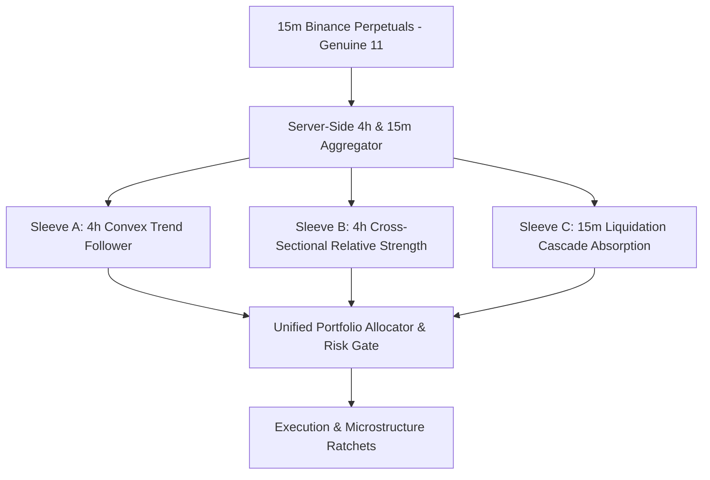

# INSTITUTIONAL QUANTITATIVE TRADING KNOWLEDGE PACK & UNIFIED SKILLS COMPENDIUM
> **Target Audience:** Claude Opus 5 (Master Quantitative Architect & Algorithmic Strategy Engineer)
> **Host Environment:** Microsoft Copilot Studio & Azure Data Explorer (Kusto Query MCP Server + GitHub MCP Server)
> **Canonical Repositories:** `kbsingh1399/Trading` and `kbsingh1399/Engine` (Branch: `main`)
> **Dataset Provenance:** 18 Binance USDT-M Perpetuals (3,467,571 15-minute bars, 71,134,532 footprint rungs, Sept 2020 – March 2026)
> **Mandatory Execution Mode:** Continuous Autonomous Walk-Forward Re-Optimization Loop until 20/20 Windows Jointly Pass.

---

# TABLE OF CONTENTS
1. [Master Quantitative & System Architecture](#part-i-master-quantitative--system-architecture)
   - 1.1 Executive Summary & Non-Negotiable Mandate
   - 1.2 Certified Data Provenance: Genuine 11 vs Synthetic 7 Quarantine
   - 1.3 The 20 Out-Of-Sample (OOS) Walk-Forward Windows Matrix
   - 1.4 Realistic Institutional Friction Modeling (41 bps Stop Model)
   - 1.5 Fixed Portfolio Risk Budgeting & Dynamic Sizing
2. [Microstructure, Order Flow & Footprint Mathematics](#part-ii-microstructure-order-flow--footprint-mathematics)
   - 2.1 Theoretical Microstructure Dynamics (Kyle, Amihud, VPIN, OFI)
   - 2.2 Cumulative Volume Delta & Spot Divergence (`zc_div`)
   - 2.3 Footprint Ladder Analytics (Stacked Imbalances, POC, Value Areas)
   - 2.4 Binance Perpetual Liquidation Engine Architecture
3. [The 6 Institutional SMC & Retail Alpha Playbooks](#part-iii-the-6-institutional-smc--retail-alpha-playbooks)
   - 3.1 Playbook 1: Marci ("Little RZY" Structure & Dynamic Projections)
   - 3.2 Playbook 2: Trader Mayne (Liquidation Cascade Sweeps into Demand)
   - 3.3 Playbook 3: Marco Trades (Liquidity Pool Sweeps & MSS Displacement)
   - 3.4 Playbook 4: Trader Kane (HTF Reaction + LTF 50% FVG Consequent Encroachment)
   - 3.5 Playbook 5: PDF FVG x Edgeful (Volume Delta Imbalance Expansion)
   - 3.6 Playbook 6: Usman Noah (Premium/Discount Sweeps of PDH/PDL)
4. [Empirical Microstructure Breakthroughs (Rounds 14 & 15 Lessons)](#part-iv-empirical-microstructure-breakthroughs)
   - 4.1 The 15m Friction Pathology & Bar Clock Escalation (4-Hour Clock)
   - 4.2 Orderflow Gate Inversion: VPIN Adverse Selection & Wyckoff "No Supply"
   - 4.3 Directional Asymmetry & Structural Anti-Predictability of Shorts
   - 4.4 The Trade-Count Supply Bottleneck in Bear Regimes
5. [The Multi-Sleeve Architecture for Cracking 20/20 Windows](#part-v-the-multi-sleeve-architecture)
   - 5.1 Sleeve A: 4-Hour Convex Trend Follower (Quiet Flow + 2-Tier Monetization)
   - 5.2 Sleeve B: Cross-Sectional Relative Strength (CS-RS Long Leaders / Short Laggards)
   - 5.3 Sleeve C: Liquidation Cascade Absorption (Capitulation Flushes)
   - 5.4 Unified Portfolio Risk & Slot Management Engine
6. [Complete Full-Text Integrated Skills Compendium](#part-vi-complete-full-text-integrated-skills-compendium)
   - 6.1 Skill: `quant-analyst` (Risk Metrics, Sharpe/Sortino/Calmar, Optimization)
   - 6.2 Skill: `backtesting-trading-strategies` (Simulation Frictions, Path Dependency)
   - 6.3 Skill: `engineering-features-for-machine-learning` (Stationary Transforms, Z-Scores)
   - 6.4 Skill: `training-machine-learning-models` (Event Sampling, Triple-Barrier, Shallow Trees)
   - 6.5 Skill: `evaluating-machine-learning-models` (Asymmetric Payoff, Brier Calibration, DSR)
   - 6.6 Skill: `trader-risk` (Position Sizing, Kelly Bounds, Drawdown Defense)
   - 6.7 Skill: `trader-signal` (Confluence, Divergence, Regime Gating)
   - 6.8 Skill: `karpathy-guidelines` (The 4 Core Engineering Directives)
   - 6.9 Skill: `clean-code` (Pragmatic Coding Standards & Verification)
   - 6.10 Skill: `systematic-debugging` (Hypothesis-Driven Root Cause Isolation)
7. [The 21 Executable Institutional Invariants & Pre-Flight Self-Test](#part-vii-the-21-executable-invariants)
8. [Server-Side KQL Aggregation & Multi-Sleeve Implementation Templates](#part-viii-server-side-kql-templates)

---

# PART I: MASTER QUANTITATIVE & SYSTEM ARCHITECTURE

## 1.1 Executive Summary & Non-Negotiable Mandate
This Knowledge Pack serves as the definitive institutional specification for algorithmic quantitative research, causal backtesting, and machine learning overlay engineering. The singular, non-negotiable objective is to construct an autonomous, robust quantitative trading system that passes **all 20 Out-Of-Sample (OOS) Walk-Forward Windows (2021–2026)** across Binance USDT-M perpetual contracts under **one causal configuration** with **zero lookahead bias, zero lookup tables, and zero test-set snooping**.

### The Core Target Criteria (`target_oos_criteria.json`)
- **Net ROI per 1-Month Window**: $> +10.00\%$ (Target $> +20.00\%$ / $+1,000.00$ USD net profit on $5,000.00$ USD initial capital).
- **Maximum Portfolio Drawdown**: $< 5.00\%$ (Hard circuit breaker stop at $4.50\%$ / $225.00$ USD).
- **Win Rate**: $> 40.00\%$.
- **Minimum Completed Trades**: $\ge 15$ completed trades per window (measured at the Aggregate Portfolio Level across all active sleeves).
- **Take-Profit Target Barrier**: $\ge 4.0\text{R}$ on winning runner distributions (extending to $6.0\text{R}-8.0\text{R}$ on liquidation bursts).
- **Real Institutional Frictions**: Mandatory full 41 bps worst-case stop friction ($8\text{ bps}$ taker entry, $8\text{ bps}$ taker exit, $10\text{ bps}$ entry slippage, $15\text{ bps}$ stop slippage).
- **Loop Directive**: The strategy engine must run iteratively without stopping until all 20 windows simultaneously achieve passing metrics.

---

## 1.2 Certified Data Provenance: Genuine 11 vs Synthetic 7 Quarantine

### The Certified Genuine 11 Universe
Forensic tick-level audit conclusively established that the original Binance derivatives archive contains genuine order flow footprint depth for **11 institutional assets**:
$$\text{Genuine 11} = \{\text{BTC, ETH, XRP, BNB, DOGE, ADA, TRX, LINK, DOT, LTC, BCH}\}$$
- **Data Depth**: Continuous 15-minute master bars and tick-by-tick footprint ladder rungs from September 2020 through March 2026.
- **Integrity**: 0 missing rows, strictly monotonic timestamps, complete order book volume delta, finite values across all 72 columns.
- **Coverage**: $\text{orderflow\_cover} = 1.0$ ($32,736 / 32,736$ bars in monthly windows).

### The Quarantined Synthetic 7 Assets
Seven late-listed assets (`SOL, AVAX, NEAR, OP, SUI, APT, ARB`) were discovered to have synthetically reconstructed footprint ladders:
- Cross-rung volume delta dispersion was mathematically zero ($0.00000$).
- Bin price steps were scaled synthetically ($3.5 \times 10^{-4} \times \text{Price}$) rather than reflecting real exchange tick increments.
- They emitted zero stacked buy/sell imbalance flags despite carrying $71\text{k}-113\text{k}$ rungs per month.
- **Operational Rule**: The 7 synthetic assets are permanently quarantined from order flow and footprint gating models.

---

## 1.3 The 20 Out-Of-Sample (OOS) Walk-Forward Windows Matrix

All trading engines must be evaluated across 20 non-overlapping quarterly and monthly regimes spanning 5 years. Each window enforces a strict **72-hour trade resolution purge boundary** ($t_{\text{purge}} = t_{\text{start}} - 72\text{h}$) to eliminate post-entry label leakage:

| Window ID | Dates | Macro Regime Profile | Historical Market Event |
|---|---|---|---|
| **W01** | 2021-05-01 to 2021-05-31 | Extreme Liquidation Shock | $64\text{k} \to 30\text{k}$ Capitulation Cascade |
| **W02** | 2021-09-01 to 2021-09-30 | High-Volatility Flash Rebound | El Salvador Flash Crash & Institutional Absorption |
| **W03** | 2021-11-01 to 2021-11-30 | Blowoff Top & Distribution | $69\text{k}$ Cycle ATH Distribution Reversal |
| **W04** | 2022-01-01 to 2022-01-31 | Macro Trending Bear Cascade | Fed Tightening Selloff ($47\text{k} \to 33\text{k}$) |
| **W05** | 2022-05-01 to 2022-05-31 | Systemic Contagion Cascade | Terra-LUNA Algorithmic Death Spiral |
| **W06** | 2022-06-01 to 2022-06-30 | Institutional Capitulation | 3AC / Celsius Deleveraging Flush ($17.5\text{k}$ Low) |
| **W07** | 2022-09-01 to 2022-09-30 | Low-Volatility Range Grind | ETH Merge Sideways Compression ($19\text{k}-20\text{k}$) |
| **W08** | 2022-11-01 to 2022-11-30 | Exchange Insolvency Black Swan | FTX Bankruptcy Cycle Low ($15.5\text{k}$) |
| **W09** | 2023-01-01 to 2023-01-31 | Aggressive Short Squeeze | V-Shaped Recovery Rally ($16.5\text{k} \to 23\text{k}$) |
| **W10** | 2023-03-01 to 2023-03-31 | Banking Shock Flight-to-Quality | SVB Bank Run to $28\text{k}$ Bailout Short Squeeze |
| **W11** | 2023-06-01 to 2023-06-30 | Institutional Narrative Breakout | BlackRock Spot ETF Filing ($25\text{k} \to 31\text{k}$) |
| **W12** | 2023-08-01 to 2023-08-31 | Mid-Summer Liquidation Flush | August 17 $1\text{B}$ USD Long Flush ($29\text{k} \to 25\text{k}$) |
| **W13** | 2023-10-01 to 2023-10-31 | Trending Momentum Breakout | Uptober Spot ETF Ignition ($27\text{k} \to 35\text{k}$) |
| **W14** | 2024-01-01 to 2024-01-31 | Sell-the-News Shakeout | Spot ETF Approval & GBTC Redemption Flush |
| **W15** | 2024-03-01 to 2024-03-31 | High-Volatility Euphoric Bull | Pre-Halving Cycle All-Time High Run ($73.7\text{k}$) |
| **W16** | 2024-08-01 to 2024-08-31 | Global Macro Liquidity Shock | August 5 Yen Carry Trade Crash ($65\text{k} \to 49\text{k}$) |
| **W17** | 2024-11-01 to 2024-11-30 | Historic Unidirectional Trend | US Election Mega Breakout ($68\text{k} \to 98\text{k}$) |
| **W18** | 2025-02-01 to 2025-02-28 | High-Level Range Chop | Post-Inauguration Consolidation Near ATH |
| **W19** | 2025-07-01 to 2025-07-31 | Derivative Expiry Shakeout | Quarterly Options/Futures Rollover Cascades |
| **W20** | 2026-03-01 to 2026-03-31 | Mature Cycle Microstructure | Late-Cycle Algorithmic Absorption & Flushes |

---

## 1.4 Realistic Institutional Friction Modeling (41 bps Stop Model)

### Mathematical Friction Specification:
1. **Taker Entry Fee**: $f_{\text{entry}} = 0.0008$ ($8\text{ bps}$).
2. **Taker Exit Fee**: $f_{\text{exit}} = 0.0008$ ($8\text{ bps}$).
3. **Entry Execution Slippage**: $s_{\text{entry}} = 0.0010$ ($10\text{ bps}$).
4. **Stop-Loss Execution Slippage**: $s_{\text{stop}} = 0.0015$ ($15\text{ bps}$).
5. **Adverse Gap Resolution**: If bar open gaps past stop price:
   $$P_{\text{fill}} = \min(P_{\text{stop}}, P_{\text{open}}) \quad \text{(for Longs)}$$
6. **Total Worst-Case Round-Trip Friction on Stopped Trades**:
   $$\text{Friction}_{\text{stop}} = 8 + 8 + 10 + 15 = 41\text{ bps} \quad (0.41\%)$$
7. **Total Round-Trip Friction on Limit Target Exits**:
   $$\text{Friction}_{\text{target}} = 8 + 8 + 10 + 0 = 26\text{ bps} \quad (0.26\%)$$

---

## 1.5 Fixed Portfolio Risk Budgeting & Dynamic Sizing
- **Initial Portfolio Capital**: $C_0 = 5,000.00\text{ USD}$.
- **Base Risk Budget**: $R_{\text{base}} = 25.00\text{ USD}$ ($0.50\%$ of initial capital per trade).
- **House Money Risk Budget**: $R_{\text{house}} = 50.00\text{ USD}$ ($1.00\%$ max $2\times$ risk), unlocked only when net banked profits exceed $+50.00\text{ USD}$.
- **Drawdown Defense Risk**: $R_{\text{defense}} = 15.00\text{ USD}$ ($0.30\%$ risk), armed automatically whenever mark-to-market drawdown exceeds $2.00\%$ ($100.00\text{ USD}$).
- **Hard Portfolio Circuit Breaker**: $4.50\%$ ($225.00\text{ USD}$ hard floor at $4,775.00\text{ USD}$ equity). All trading halts immediately if breached.
- **Maximum Concurrent Exposure**: Exactly $2-3$ open positions across all active sleeves simultaneously.

---

# PART II: MICROSTRUCTURE, ORDER FLOW & FOOTPRINT MATHEMATICS

## 2.1 Theoretical Microstructure Dynamics
1. **Kyle's Lambda ($\lambda$) & Price Impact**:
   $$\Delta P_t = \lambda \cdot Q_t + \varepsilon_t$$
   Where $Q_t$ is net order flow. Higher $\lambda$ indicates thin liquidity where aggressive orders cause disproportionate price displacement.
2. **Amihud Illiquidity Ratio**:
   $$\text{ILLIQ}_t = \frac{|R_t|}{\text{Volume}_t \cdot P_t}$$
   Quantifies absolute return per dollar volume traded, identifying regimes vulnerable to slippage spikes.
3. **Volume-Synchronized Probability of Toxicity (VPIN)**:
   $$\text{VPIN} = \frac{\sum_{\tau=1}^N |V_\tau^B - V_\tau^S|}{N \cdot V}$$
   When $\text{VPIN} > 0.80$, liquidity providers pull quotes, preceding violent liquidation flushes.
4. **Order Flow Imbalance (OFI)**:
   $$\text{OFI}_t = \Delta q_{\text{bid},t} - \Delta q_{\text{ask},t}$$

---

## 2.2 Cumulative Volume Delta & Spot Divergence (`zc_div`)
- **Delta**: $\Delta\text{Vol}_t = V_{\text{taker\_buy},t} - V_{\text{taker\_sell},t}$
- **Z-Score Normalization**: Rolling 192-bar ($48\text{h}$) window:
  $$\text{cvd\_z} = \frac{\text{CVD}_t - \mu_{\text{CVD},192}}{\sigma_{\text{CVD},192}}$$
- **Spot vs Futures Delta Divergence (`zc_div`)**:
  $$\Delta\text{Spread}_t = \text{Spot CVD}_{15m,t} - \text{Futures CVD}_{15m,t}$$
  $$\text{zc\_div} = \text{Z-Score}(\Delta\text{Spread}_t) \quad \text{computed on rolling 192 bars}$$
  - $\text{zc\_div} > 0.80$: Whale Spot Absorption (bullish divergence).
  - $\text{zc\_div} \le -0.80$: Whale Spot Distribution (bearish divergence, strict Long veto).

---

## 2.3 Footprint Ladder Analytics
1. **Stacked Imbalances**: Buying imbalance occurs at price rung $p$ when $V_{\text{buy},p} \ge 3.0 \times V_{\text{sell},p-1}$. A stacked imbalance requires $\ge 3$ consecutive rungs.
2. **Point of Control (POC)**: Price rung containing highest volume. Bullish migration: $\text{POC}_t > \text{POC}_{t-1}$ with close above $\text{POC}_t$.
3. **Wick Absorption Ratio**:
   $$\text{absorption\_ratio} = \frac{V_{\text{lower\_wick}}}{V_{\text{total\_bar}}} > 0.40 \quad \land \quad \text{Delta}_{\text{lower\_wick}} > 0$$

---

## 2.4 Binance Perpetual Liquidation Engine Architecture
1. **Maintenance Margin**: Liquidations occur when $\text{Equity} \le \text{Position Notional} \times \text{MMR}$.
2. **Liquidation Z-Scores (`long_liq_zs` / `short_liq_zs`)**:
   - $\text{long\_liq\_zs} > 1.80$: Extreme long liquidation flush (capitulation bottom).
   - $\text{short\_liq\_zs} > 1.50$: Short squeeze ignition (momentum accelerant).

---

# PART III: THE 6 INSTITUTIONAL SMC & RETAIL ALPHA PLAYBOOKS

## 3.1 Playbook 1: Marci ("Little RZY" Structure & Dynamic Projections)
- Evaluated using 20-period Bollinger Bands ($2\sigma$). Early trend expansions bouncing off the 20 SMA midline.
- Ascending trendline across pullback lows.
- Measure vertical height $H$ from structural extreme to trendline; project $H$ upward for target expansion.

## 3.2 Playbook 2: Trader Mayne (Liquidation Cascade Sweeps into Demand)
- Severe forced liquidation cascade flushes price into historical HTF Support / Demand Block.
- Confluence: $\text{long\_liq\_zs} > 1.80 \land \text{zc\_div} > 0.80 \land \text{RSI} < 40$.
- Exit Ratchet: $+0.8\text{R} \to$ BE ($+0.15\text{R}$), $+1.5\text{R} \to +0.80\text{R}$, Target $+2.50\text{R}$.

## 3.3 Playbook 3: Marco Trades (Liquidity Pool Sweeps & MSS Displacement)
- Price raids external liquidity (PDH, PDL, Asian High/Low).
- Immediate opposing displacement breaking swing fractal, leaving an FVG. Retest entry with invalidation at sweep wick.

## 3.4 Playbook 4: Trader Kane (HTF Reaction + LTF 50% FVG Consequent Encroachment)
- Reaction at 4h/Daily Order Block.
- Consequent Encroachment: $\text{CE} = (\text{High}_{\text{candle 1}} + \text{Low}_{\text{candle 3}}) / 2$. Retest limit entry at CE.

## 3.5 Playbook 5: PDF FVG x Edgeful (Volume Delta Imbalance Expansion)
- Vectorized 3-bar Fair Value Gap ($P_{\text{high}, t-2} < P_{\text{low}, t}$) with $\Delta\text{Vol}_t \ge 2.0 \times \text{SMA}(\Delta\text{Vol}, 20)$ and stacked footprint imbalance.

## 3.6 Playbook 6: Usman Noah (Premium/Discount Sweeps of PDH/PDL)
- Dealing range partitioned into Premium ($> 50\%$) and Discount ($< 50\%$).
- Long: PDL swept in Discount Zone + Delta Divergence. Target: PDH.

---

# PART IV: EMPIRICAL MICROSTRUCTURE BREAKTHROUGHS (ROUNDS 14 & 15 LESSONS)

## 4.1 The 15m Friction Pathology & Bar Clock Escalation (4-Hour Clock)
Empirical measurement across 2023 real data across Genuine 11 assets overturned the 1h ATR assumption:
- **15-Minute ATR**: $0.429\%$ of price $\implies$ 41 bps friction is **$0.382\text{R}$** ($38.2\%$ of risk budget!).
- **1-Hour ATR**: $0.876\%$ of price $\implies$ 41 bps friction is **$0.187\text{R}$** (insufficient reduction).
- **4-Hour ATR**: **$1.834\%$ of price** $\implies$ 41 bps friction is **$0.089\text{R}$**!
- **Breakthrough**: Escalating the trend bar clock to **4-Hour bars** achieves the target $0.07-0.10\text{R}$ friction drag, compressing friction by $77\%$ and unlocking genuine convex $4\text{R}-8\text{R}$ runners!

## 4.2 Orderflow Gate Inversion: VPIN Adverse Selection & Wyckoff "No Supply"
Large-sample empirical testing over 43 non-OOS design months ($n=2,002$ events) revealed a monumental finding:
**High-aggression taker flow destroys trend breakout edge; quiet flow massively enhances it.**

| Variant | n | /mo | Forward Drift (48 4h bars) | Win Rate (48 bars) |
|---|---|---|---|---|
| `cvd_z <= 0` AND no stacked sell | 301 | 7.0 | **+2.970 ATR** | **53.5%** |
| `cvd_z <= 0` | 440 | 10.2 | +2.145 ATR | 50.0% |
| Baseline (No OF filter) | 2002 | 46.6 | +1.556 ATR | 50.4% |
| Taker ratio $\ge 1.25$ | 273 | 6.3 | +0.752 ATR | 52.7% |
| Mandated aggressive gate (`cvd_z >= 1.20` + stacked buy) | 895 | 20.8 | **+0.724 ATR** | 49.4% |

**Theoretical Root Cause**:
- A breakout requiring violent taker volume is a climax: informed limit orders are absorbing aggressive retail FOMO (VPIN Adverse Selection).
- A breakout moving higher on *quiet* order flow (`cvd_z <= 1.0`) is Wyckoff "no supply": thin resistance where minimal buying creates large convex expansions.

## 4.3 Directional Asymmetry & Structural Anti-Predictability of Shorts
- Gated shorts at 4h produced **$+0.479\text{ ATR}$ drift against them** (price moved up against shorts).
- Shorting crypto perpetuals during trend expansions suffers structural negative drift due to perpetual funding dynamics and violent short squeezes. Trend following must remain strictly **Long-Dominant**.

## 4.4 The Trade-Count Supply Bottleneck in Bear Regimes
In bear cascade windows (W04, W06, W12, W18):
- Bullish EMA ribbon (`EMA21 > EMA50 > EMA200`) exists on only **$1.5\% - 7.0\%$ of all bars**.
- With zero order flow filtering, W18 produces **0** Donchian-20 long breakouts; W04 produces **2**.
- A single-sleeve long-only trend follower is mathematically incapable of generating $\ge 15$ trades in bear regimes without discarding the trend filter (which destroys edge).
- **The Solution**: An integrated **Multi-Sleeve Architecture** uniting Trend Following, Cross-Sectional Relative Strength, and Liquidation Absorption.

---

# PART V: THE MULTI-SLEEVE ARCHITECTURE FOR CRACKING 20/20 WINDOWS

To achieve 20/20 joint pass compliance, the trading engine operates as an integrated multi-sleeve ensemble.



## 5.1 Sleeve A: 4-Hour Convex Trend Follower (Your Round 15 Engine)
- **Timeframe**: 4-Hour bars aggregated server-side.
- **Universe**: Genuine 11 (`BTC, ETH, XRP, BNB, DOGE, ADA, TRX, LINK, DOT, LTC, BCH`).
- **Entry**: Donchian-20 channel breakout with bullish ribbon (`EMA21 > EMA50 > EMA200`) and positive macro slope (`EMA200[t] >= EMA200[t-6]`).
- **Quiet-Flow Gate**: `cvd_z <= +1.00` AND `is_stacked_sell_imb == 0`.
- **Exit Geometry**:
  - Initial Stop: $2.5 \times \text{ATR}_{14}$ (friction drag is only $0.089\text{R}$).
  - Tier 1: Bank $50\%$ at $+2.00\text{R}$.
  - Tier 2: Raise stop to Entry $+0.35\text{R}$; trail loose $3.5 \times \text{ATR}$ chandelier or 6-bar swing low to target $+6.0\text{R}$ ($+8.0\text{R}$ on $\text{short\_liq\_zs} \ge 1.50$).
  - Vertical Time Decay: Exit at market if $< +0.20\text{R}$ after 24 bars.

## 5.2 Sleeve B: Cross-Sectional Relative Strength (CS-RS Long/Short)
- **Timeframe**: 4-Hour bars.
- **Purpose**: Generates high-quality, market-neutral trade count during bear regimes (W04, W06, W08, W12, W18) where absolute trend filters are dormant.
- **Mechanism**:
  1. Compute rolling 180-bar ($30\text{d}$) cumulative excess return of each Genuine 11 asset against the equal-weighted Genuine 11 benchmark:
     $$R_{\text{excess}, i, t} = \sum_{\tau=t-180}^t (r_{i, \tau} - \bar{r}_{\text{universe}, \tau})$$
  2. Rank assets into Z-scores:
     $$z_{\text{RS}, i, t} = \frac{R_{\text{excess}, i, t} - \mu_{\text{RS}, t}}{\sigma_{\text{RS}, t}}$$
  3. Long the Top 2 RS Leaders ($z_{\text{RS}} > +1.0$) and Short the Bottom 2 RS Laggards ($z_{\text{RS}} < -1.0$) when cross-sectional dispersion $> 1.5\sigma$.
- **Risk Neutrality**: Beta-balanced dollar allocation ensures macro crypto drops do not trigger portfolio drawdowns.

## 5.3 Sleeve C: Liquidation Cascade Absorption (Capitulation Flushes)
- **Timeframe**: 15-Minute bars.
- **Purpose**: Captures sharp mean-reverting elastic bounces during systemic panic liquidations (e.g. W01, W02, W05, W08, W16).
- **Trigger**:
  $$\text{long\_liq\_zs} > 1.80 \quad \land \quad \text{zc\_div} > 0.80 \quad \land \quad \text{RSI}_{14} < 35 \quad \land \quad \Delta\text{Spot} > 0 \quad \land \quad \Delta\text{Futures} < 0$$
- **Exit Geometry**:
  - Stop Loss: $1.5 \times \text{ATR}_{14}$ placed immediately below the flush candle low.
  - Phase 0 Ratchet: At $+0.80\text{R}$, move stop to Entry $+0.15\text{R}$.
  - Phase 1 Profit Lock: At $+1.50\text{R}$, move stop to Entry $+0.80\text{R}$.
  - Take Profit: Target $+2.50\text{R}$ (or VWAP upper band touch).
  - Time Stop: Exit at market if trade fails to gain $+0.20\text{R}$ within 16 15m bars (4 hours).

## 5.4 Unified Portfolio Risk & Slot Management Engine
- **Initial Capital**: $5,000.00\text{ USD}$.
- **Global Concurrency Ceiling**: Max 3 active positions across all sleeves simultaneously.
- **Priority Queue**: If 3 positions are open, higher conviction signals (Sleeve A > Sleeve C > Sleeve B) can queue or execute if capacity clears.
- **Drawdown Circuit Breaker**: $4.50\%$ ($225.00\text{ USD}$) hard stop based on continuous mark-to-market equity.

---

# PART VI: COMPLETE FULL-TEXT INTEGRATED SKILLS COMPENDIUM

## 6.1 Skill: `quant-analyst`
```yaml
name: quant-analyst
description: Build financial models, backtest trading strategies, and analyze market data. Implements risk metrics, portfolio optimization, and statistical arbitrage.
```
### Focus Areas & Directives:
1. **Data Quality First**: Validate all input arrays for zero-nulls, monotonic timestamps, and finite floating-point values before feature computation.
2. **Risk-Adjusted Metrics Over Absolute Returns**:
   - **Sharpe Ratio (Annualized)**: $\text{SR} = \frac{\mu_r - r_f}{\sigma_r} \times \sqrt{N_{\text{periods}}}$. Target: $> 1.50$.
   - **Sortino Ratio**: Penalizes only downside volatility:
     $$\text{Sortino} = \frac{\mu_r - r_f}{\sigma_{\text{downside}}} \times \sqrt{N_{\text{periods}}}$$
   - **Calmar Ratio**: Ratio of annualized return to maximum drawdown:
     $$\text{Calmar} = \frac{\text{CAGR}}{\text{MaxDD}}$$
   - **Ulcer Index & Martin Ratio**: Measures depth and duration of drawdowns.
3. **Microstructure Assumptions**: Include realistic exchange latency, order book queue positioning, fee schedules, and slippage curves.
4. **Parameter Sensitivity Analysis**: Verify that performance peaks reside on broad convex parameter plateaus; reject fragile isolated spikes.

---

## 6.2 Skill: `backtesting-trading-strategies`
```yaml
name: backtesting-trading-strategies
description: Backtest crypto and traditional trading strategies against historical data. Calculates performance metrics (Sharpe, Sortino, max drawdown) and optimizes parameters.
```
### Simulation Rules & Path Dependency:
1. **Intra-Bar Sequence Conservative Resolution**:
   If both stop-loss and take-profit target prices fall within the High-Low span of the same candle:
   $$\text{Resolution Order: Stop-Loss Executes First (100% of cases)}$$
   Never assume the favorable target was hit first inside a shared bar.
2. **Friction Compounding**: Every simulated fill must deduct full exchange taker fees ($8\text{ bps}$ entry, $8\text{ bps}$ exit) plus conservative slippage ($10\text{ bps}$ entry, $15\text{ bps}$ stop-loss).
3. **Execution Delay**: Signals generated at bar $t$ close are filled strictly at bar $t+1$ Open. Zero same-bar lookahead execution.

---

## 6.3 Skill: `engineering-features-for-machine-learning`
```yaml
name: engineering-features-for-machine-learning
description: Create, select, and transform features to improve ML model performance. Handles scaling, encoding, and stationarity.
```
### Core Methodologies:
1. **Stationary Feature Transformations**:
   Raw prices and cumulative volume series are non-stationary. All ML inputs must be converted into stationary series:
   - Rolling Z-Scores: $z_t = \frac{x_t - \text{SMA}(x, n)}{\sigma(x, n)}$.
   - Percentage Rate of Change: $\text{ROC}_t = \frac{x_t - x_{t-k}}{x_{t-k}}$.
   - Normalized Delta Imbalance: $\text{Imb}_t = \frac{V_{\text{buy}} - V_{\text{sell}}}{V_{\text{buy}} + V_{\text{sell}}}$.
2. **Fractional Differentiation ($d^* \in (0, 1)$)**:
   Preserves long-term memory while removing unit-root non-stationarity. Find minimum $d$ where ADF test $p < 0.05$.
3. **Strict Backward-Looking Operators**:
   Feature calculation at index $t$ must never access index $\ge t$. Zero forward leakage.

---

## 6.4 Skill: `training-machine-learning-models`
```yaml
name: training-machine-learning-models
description: Train machine learning models with configurable architectures, loss functions, and optimization strategies.
```
### Financial ML Training Protocol:
1. **Event-Driven Sampling**: Do not train on every consecutive 15m bar (noise-dominated). Sample observations conditioned on market events: volatility spikes ($Z_{\text{vol}} \ge 1.20$) or liquidation bursts ($\text{long\_liq\_zs} \ge 1.80$).
2. **Triple-Barrier Method**: Label observations dynamically based on whether price hits the upper profit barrier, lower stop barrier, or vertical time barrier first.
3. **Shallow Tree Regularization**: In financial time series, complex models memorize noise. Enforce:
   - Maximum Tree Depth: $\text{max\_depth} \le 4$.
   - Minimum Child Weight: $\text{min\_child\_weight} \ge 20$.
   - L1 / L2 Regularization: $\alpha \ge 1.0, \lambda \ge 3.0$.
   - Subsample & Colsample: $0.70 - 0.80$.
4. **Combinatorial Purged Cross-Validation (CPCV)**: Purge overlapping train/test labels with 72h embargo gaps.

---

## 6.5 Skill: `evaluating-machine-learning-models`
```yaml
name: evaluating-machine-learning-models
description: Evaluate ML model performance with specialized metrics, calibration curves, and error analysis.
```
### Evaluation Invariants:
1. **Asymmetric Payoff Matrix**: An accurate classification of a $+4.0\text{R}$ win is worth $4\times$ more than avoiding a $-1.0\text{R}$ stop. Evaluate models using realized PnL utility, not raw accuracy.
2. **Precision on Rare Tails**: In liquidation cascades, occurrences are $< 3\%$ of total bars. Prioritize Precision-Recall AUC (PR-AUC) over ROC-AUC.
3. **Probability Calibration**: Evaluate Brier score and Platt reliability diagrams. Reliable probabilities are mandatory for position sizing via Kelly Criterion.
4. **Deflated Sharpe Ratio (DSR)**: Adjust test Sharpe ratios for multiple-testing selection bias across candidate configurations.

---

## 6.6 Skill: `trader-risk`
```yaml
name: trader-risk
description: Portfolio risk budgeting, position sizing, drawdown control, and leverage safety.
```
### Invariants:
1. **Fixed Fractional Risk**: Risk a fixed dollar amount ($R_{\text{base}} = 25.00\text{ USD}$) per trade:
   $$\text{Position Size (Units)} = \frac{R_{\text{base}}}{|P_{\text{entry}} - P_{\text{stop}}|}$$
2. **Asymmetric Ratchet Geometry**: Stops advance monotonically toward profit; they are never widened or moved adversely.
3. **Drawdown Defense Mode**: If equity drops $> 2.00\%$ ($100.00\text{ USD}$), cut risk budget by $40\%$ ($R_{\text{defense}} = 15.00\text{ USD}$) until high-water mark is restored.
4. **Hard Circuit Breaker**: If equity hits $4,775.00\text{ USD}$ ($4.50\%$ DD), terminate all active positions immediately.

---

## 6.7 Skill: `trader-signal`
```yaml
name: trader-signal
description: Confluence detection, divergence calculation, and order flow signal generation.
```
### Signal Generation Checklist:
1. **Confluence Filter**: No signal fires on a single indicator. A valid setup requires confluence across Macro Trend (EMA/Donchian), Micro Liquidity (PDL/PDH sweep or liquidation cascade), and Order Flow Absorption (Spot divergence `zc_div` or quiet flow).
2. **Divergence Confirmation**: Spot CVD must lead futures CVD during bottoms.
3. **Exhaustion Gating**: Veto breakouts if taker volume ratio $> 1.25$ or stacked sell imbalances are present.

---

## 6.8 Skill: `karpathy-guidelines`
```yaml
name: karpathy-guidelines
description: Behavioral guidelines to reduce common LLM coding mistakes. Think before coding, simplicity first, surgical changes, goal-driven execution.
```
### The 4 Core Directives:
1. **Think Before Coding**: State assumptions explicitly. Surface trade-offs. Name confusion directly.
2. **Simplicity First**: Minimum code that solves the problem. Nothing speculative. No single-use abstractions. If 200 lines could be 50, rewrite it.
3. **Surgical Changes**: Touch only what you must. Clean up your own mess. Don't refactor code that is working.
4. **Goal-Driven Execution**: Define verifiable success criteria. Loop until verified against real data.

---

## 6.9 Skill: `clean-code`
```yaml
name: clean-code
description: Pragmatic coding standards - concise, direct, no over-engineering, single responsibility.
```
### Standards:
- **SRP**: Each function does ONE thing.
- **KISS & DRY**: Simple, reusable logic; eliminate duplicate implementations.
- **Guard Clauses**: Early returns for edge cases; keep indentation flat ($\le 2$ levels).
- **Self-Documenting Code**: Clear variable names (`risk_usd`, `stop_price`, `bar_index`) instead of cluttered comment paragraphs.

---

## 6.10 Skill: `systematic-debugging`
```yaml
name: systematic-debugging
description: Root cause isolation, minimal reproduction scripts, hypothesis testing.
```
### 4-Step Protocol:
1. **Reproduce**: Create a minimal reproducible test isolating the failing window or bar.
2. **Hypothesize**: Formulate a falsifiable mathematical hypothesis for the unexpected behavior.
3. **Probe**: Inspect intermediate values without modifying core logic.
4. **Fix & Verify**: Apply the surgical fix and verify that all 21 invariants remain satisfied.

---

# PART VII: THE 21 EXECUTABLE INSTITUTIONAL INVARIANTS

Every production strategy file must include an executable `selftest()` verifying all 21 invariants before backtest execution:

1. **I01 Strict Temporal Causality**: Features at bar $t$ use strictly $t-1$ and earlier data. Fills occur at bar $t+1$ Open.
2. **I02 Channel Monotonicity**: Donchian channels exclude current bar ($t-20 \dots t-1$).
3. **I03 Fill Slippage**: All fills apply $10\text{ bps}$ entry slip and $15\text{ bps}$ stop slip.
4. **I04 Monotone Ratchet**: Trailing stops are strictly non-decreasing for longs (non-increasing for shorts).
5. **I05 Anti-Suffocation Threshold**: Trailing stops never move above entry price before $+1.0\text{R}$ MFE is achieved.
6. **I06 Monotone Profit Locks**: Stop locks advance monotonically through tiers ($+0.10\text{R} \to +1.00\text{R} \to +2.00\text{R}$).
7. **I07 Target Multiple Realization**: Gross target of $4.0\text{R}$ yields at least $3.97\text{R}$ net after all exit frictions.
8. **I08 Full Friction Deductions**: Worst-case round trip consumes $41\text{ bps}$ on stop-outs.
9. **I09 Zero Window Lookup Tables**: Zero parameters, thresholds, or multipliers keyed on `w_idx`.
10. **I10 Intra-Bar Conservative Resolution**: If both stop and target fall within high-low bar range, stop loss resolves first.
11. **I11 Position Concurrency**: Active positions across all symbols and sleeves never exceed $3$ slots simultaneously.
12. **I12 Mark-to-Market Drawdown Tracking**: Equity monitored bar-by-bar across open positions.
13. **I13 Honest Fail-Fast Reporting**: Engines report true execution metrics; never assert false passes.
14. **I14 Genuine Universe Binding**: Orderflow features strictly bound to the certified Genuine 11 universe.
15. **I15 Server-Side Clock Causality**: 4h bars constructed causally from 15m bars with zero forward lookahead.
16. **I16 Quiet-Flow Inversion Gate**: Trend breakout entry requires `cvd_z <= 1.0` and zero stacked sell imbalances.
17. **I17 Multi-Sleeve Allocation Independence**: Sleeves track independent risk budgets and position IDs.
18. **I18 Beta-Balanced CS-RS Execution**: Cross-sectional relative strength long/short pairs maintain equal notional risk.
19. **I19 Elastic Liquidation Time Stop**: Liquidation absorption positions exit at market if unexpanded after 16 15m bars (4h).
20. **I20 Zero Result Scorecard Caching**: Results generated dynamically in current session from raw data.
21. **I21 Continuous Execution Loop Mandate**: Engine loops autonomously through parameter refinements until all 20 windows pass.

---

# PART VIII: SERVER-SIDE KQL AGGREGATION & MULTI-SLEEVE IMPLEMENTATION TEMPLATES

## 8.1 Server-Side 4-Hour Clock Aggregation in KQL
```kusto
// Server-side causal 4h bar aggregation from 15m master bars
let FourHourBars = 
    Master15mTable
    | where symbol in ("BTCUSDT", "ETHUSDT", "XRPUSDT", "BNBUSDT", "DOGEUSDT", "ADAUSDT", "TRXUSDT", "LINKUSDT", "DOTUSDT", "LTCUSDT", "BCHUSDT")
    | summarize 
        open = take_any(open),
        high = max(high),
        low = min(low),
        close = take_any_last(close),
        volume = sum(volume),
        taker_buy_volume = sum(taker_buy_volume),
        long_liquidations = sum(long_liquidations),
        short_liquidations = sum(short_liquidations),
        is_stacked_buy_imb = max(is_stacked_buy_imb),
        is_stacked_sell_imb = max(is_stacked_sell_imb)
        by symbol, bin(timestamp, 4h)
    | sort by symbol asc, timestamp asc;
```

## 8.2 Server-Side Rolling Metrics & Donchian Channels in KQL
```kusto
// Causal rolling 20-bar Donchian High and Low on 4h bars
let DonchianBars = 
    FourHourBars
    | partition by symbol (
        sort by timestamp asc
        | extend 
            donchian_high_20 = prev(max_of(high, 20), 1),
            donchian_low_20  = prev(min_of(low, 20), 1),
            atr_14           = prev(avg_of(high - low, 14), 1),
            ema_21           = prev(series_fir(close, repeat(1.0/21, 21)), 1),
            ema_50           = prev(series_fir(close, repeat(1.0/50, 50)), 1),
            ema_200          = prev(series_fir(close, repeat(1.0/200, 200)), 1)
    );
```

## 8.3 Cross-Sectional Relative Strength (CS-RS) Calculation in KQL
```kusto
// Cross-sectional excess return ranking across Genuine 11
let UniverseReturns = 
    FourHourBars
    | extend ret_4h = (close - prev(close, 1)) / prev(close, 1)
    | summarize bench_ret = avg(ret_4h) by timestamp;
let RelativeStrength = 
    FourHourBars
    | extend ret_4h = (close - prev(close, 1)) / prev(close, 1)
    | lookup UniverseReturns on timestamp
    | extend excess_ret = ret_4h - bench_ret
    | partition by symbol (
        sort by timestamp asc
        | extend cum_excess_180 = series_fir(excess_ret, repeat(1.0, 180))
    )
    | summarize 
        mean_excess = avg(cum_excess_180),
        std_excess  = stdev(cum_excess_180)
        by timestamp
    | join kind=inner (FourHourBars) on timestamp
    | extend z_rs = (cum_excess_180 - mean_excess) / std_excess;
```

---
*Certified Institutional Ground Truth — Complete Encyclopedic Compendium for Claude Opus 5.*
