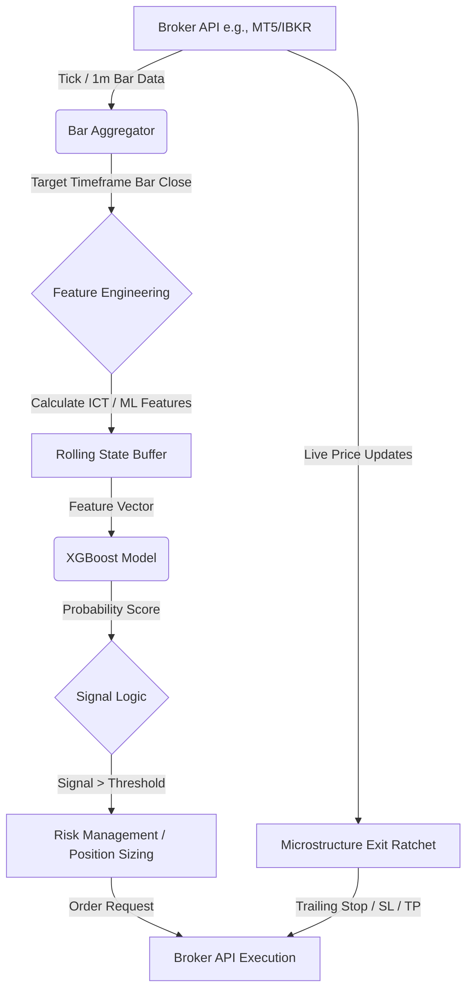

# Live ML Forex Architecture Plan (Dry Run)

This document outlines the architecture and execution plan for migrating `Engine/s2_ict_ml_forex.py` to a live "dry run" (paper trading) environment. 

## 1. Portfolio & Data Requirements

The strategy targets the following 18 assets, which include Forex, Indices, and Commodities:
`['EURHUF', 'GER30', 'NICKEL', 'USDSEK', 'GAS', 'AU200', 'FR40', 'EURCNH', 'LEAD', 'NZDUSD', 'USDHKD', 'US2000', 'AUDCHF', 'NZDCNH', 'XAUCNH', 'GAUCNH', 'EURSEK', 'EURUSD']`

### Data Provider Selection
Finding a single provider for this specific mix of exotic forex (EURHUF, EURCNH, XAUCNH), metals (NICKEL, LEAD), and global indices (GER30, AU200, FR40) requires an institutional-grade or comprehensive retail broker API.

**Recommended Providers:**
1. **Interactive Brokers (IBKR) TWS API / Client Portal API:**
   - **Pros:** Offers almost all of these assets (Forex, CFDs for Indices/Commodities, Metals). Excellent for paper trading.
   - **Cons:** Setup can be heavy (requires running TWS/IB Gateway).
2. **OANDA v20 REST API:**
   - **Pros:** Excellent for Forex and major CFDs (Indices/Metals). Extremely easy to set up paper trading.
   - **Cons:** Might lack specific industrial metals like NICKEL or LEAD, depending on the region.
3. **MetaTrader 5 (MT5) Python Integration:**
   - **Pros:** Many brokers (like IC Markets, Pepperstone) offer CFDs that cover this exact list. MT5 has a native Python library for real-time tick/bar data and execution.
   - **Cons:** Requires a Windows environment running the MT5 terminal.

**Recommendation:** **MT5 Python API** or **IBKR**. Given the exotic mix, an MT5 broker offering a wide CFD range is often the most accessible for a highly diverse portfolio dry run.

## 2. System Architecture

The live architecture will consist of three main components: Data Ingestion, Inference Engine, and Execution Engine.

### A. Data Ingestion (Real-Time Tick/Bar Aggregation)
- **WebSockets / Streaming API:** Connect to the broker to receive real-time ticks or 1-minute bars.
- **Bar Builder:** Since the strategy likely operates on a specific timeframe (e.g., 15m or 1H), the system must aggregate incoming ticks/1m bars into the target timeframe.
- **Feature Engineering Pipeline:** As soon as a bar closes, the system computes the exact same features used in `s2_ict_ml_forex.py` (ICT concepts like FVGs, Liquidity Sweeps, plus technical indicators).

### B. Inference Engine (XGBoost)
- **Model Loading:** The pre-trained XGBoost model is loaded into memory at startup.
- **State Management:** Maintain a rolling window of historical bars (e.g., last 200 bars) in a deque or Pandas DataFrame to calculate rolling features (EMAs, Z-scores).
- **Execution:** Upon bar close and feature computation, pass the feature vector to the XGBoost model.
  ```python
  prediction = xgb_model.predict(feature_vector)
  ```
- **Signal Generation:** Apply strategy thresholds (e.g., probability > 0.8) to generate BUY/SELL signals.

### C. Execution Engine (Order Management)
- **Order Routing:** Convert signals into Market or Limit orders.
- **Risk Management:** Apply the microstructure piece-wise ratchets (Phase 0 BE lock, Phase 1 Profit lock) and hard stops. 
- **Position Tracking:** Monitor open positions via the broker API to manage exits and ensure the maximum concurrent positions limit is not breached.

## 3. Real-Time Inference Loop



## 4. Phased Implementation Plan

1. **Phase 1: Environment & API Setup**
   - Select the broker (e.g., MetaTrader 5).
   - Set up the Paper Trading (Demo) account.
   - Write connection and authentication scripts.

2. **Phase 2: Data Pipeline Parity**
   - Build the real-time bar aggregator.
   - **Crucial Step:** Validate that features calculated live *exactly* match the features calculated historically. (e.g., feed historical data through the live pipeline and assert parity).

3. **Phase 3: Model Serving**
   - Export the trained XGBoost model from the 20 OOS run.
   - Wrap the model in an inference class that handles the rolling data buffer.

4. **Phase 4: Execution & Risk Logic**
   - Implement order placement logic (Market, Stop Loss, Take Profit).
   - Implement the active trade management loop (checking prices every second to move stops according to the ratchet logic).

5. **Phase 5: Dry Run Deployment**
   - Deploy the system to a local server or cloud instance (e.g., AWS EC2) running 24/5 during Forex market hours.
   - Monitor logs and execution latency.
