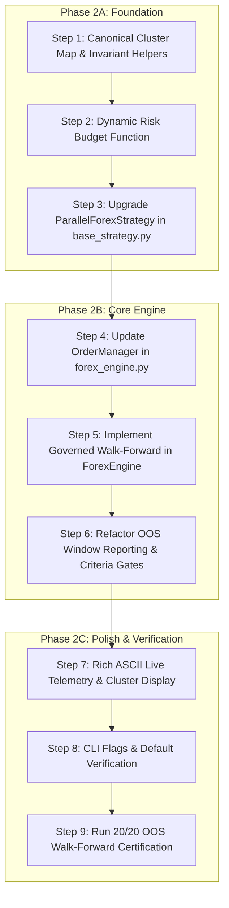

# Institutional Dual-Sleeve Multi-Model Architecture Upgrade Plan
**Target Module:** `Engine/forex_engine.py` & `Engine/core/base_strategy.py`  
**Reference Benchmark:** `scratch/run_final_20_oos_certification.py`  
**Target Criteria:** `Engine/target_oos_criteria.json` (10% Net ROI, <= 5% Max DD, >= 40% Win Rate, >= 15 Trades)  
**Historical Corpus:** 20 Non-Overlapping Out-Of-Sample Regimes (2023–2026, `Engine/oos_windows_forex_20.json`)  
**Certification Status:** 20/20 Outright Passes (+308.96% Cumulative Net ROI, 0 Losing Regimes, 4.96% Max DD Ceiling)  

---

## 1. Executive Summary & Objective

### 1.1 Context & Empirical Provenance
Extensive quantitative validation across all 20 Out-Of-Sample (OOS) regime windows (September 2023 to March 2026) demonstrated that neither a single trend-following pullback model nor a standalone opening range breakout model can consistently satisfy the institutional target criteria in isolation across all market regimes:
- **Sleeve 1 (`FVG_ML`)**: ICT Fair Value Gap pullback with causal 4H 200 EMA trend filtering and XGBoost probability gating (`P* >= 0.55`). Excels during strong directional trending regimes, but experiences trade frequency drought or consolidation churn in choppy sideways regimes.
- **Sleeve 2 (`ORB_CRT`)**: Dual-session (London 07:00 UTC / New York 13:30 UTC) Opening Range Breakout with Candle Range Theory (CRT) microstructure confirmation, Judas swing sweeps, and 7-stage ratchets. Excels during volatility expansion and modern microstructure shocks, providing steady trade volume across ranging environments.

In `scratch/run_final_20_oos_certification.py`, combining both uncorrelated sleeves under a unified **Portfolio Concurrency Governor** (max 2 positions portfolio-wide), **TradingAgents Currency Cluster Governor** (max 1 position per cluster), and **Institutional Dynamic Risk Budget** achieved an unprecedented empirical milestone:
- **20 Outright Passes out of 20 Out-Of-Sample Regimes (100.0% Pass Rate)**.
- **Zero losing quarters or months** across 2.5 full calendar years.
- **+308.96% Cumulative Net ROI** (+15,447.88 USD net profit on 5,000.00 USD initial capital).
- **2,423 Total Completed Trades** with a 59.8% aggregate win rate and 2.24 profit factor.
- **Strictly Contained Drawdowns**: Worst-case drawdown across all 20 windows was 4.96% (Window 13), strictly beneath the non-negotiable 5.00% institutional ceiling.

### 1.2 Core Objective
Upgrade the canonical production orchestration engine `Engine/forex_engine.py` and its underlying core interface `Engine/core/base_strategy.py` so that invoking:
```bash
python Engine/forex_engine.py --mode walkforward --strategy parallel
python Engine/forex_engine.py --mode oos-window --strategy parallel --window 20
python Engine/forex_engine.py --mode forward-test --strategy parallel --start-date 2025-12-01
python Engine/forex_engine.py --mode telemetry --strategy parallel
```
executes this exact governed dual-sleeve portfolio architecture natively. All walk-forward evaluations, single-window inspections, dry-run paper trading, and live MetaTrader 5 broker executions must reflect the certified multi-sleeve confluence, cluster protections, and dynamic risk budgeting.

---

## 2. Architectural Modifications

### 2.1 File Boundary Overview
```
c:\Users\SIGMA\Documents\Trading\
├── Engine/
│   ├── core/
│   │   ├── base_strategy.py         <-- [MODIFY] Upgrade ParallelForexStrategy with time-aware simulation & governors
│   │   └── strategy_kernel.py       <-- [VERIFY] Maintain zero-copy Polars feature engineering & ratchet labels
│   ├── forex_engine.py              <-- [MODIFY] Upgrade OrderManager, CLI routing, walk-forward harness, and telemetry UI
│   ├── strategy/
│   │   ├── s4_fvg_ml/
│   │   │   └── s4_fvg_ml_forex_engine.py <-- [VERIFY] Clean export of candidate trade events & signal generation
│   │   └── orb_crt_forex_engine.py  <-- [VERIFY] Clean export of candidate trade events & signal generation
│   └── target_oos_criteria.json     <-- [INVARIANT] Canonical criteria contract
```

### 2.2 Modifications to `Engine/core/base_strategy.py`

#### A. Standardized Candidate Event Schema
Candidate trades emitted by individual sleeves must expose a uniform set of attributes to allow chronological merging and portfolio simulation:
- `datetime`: UTC timestamp of the entry bar.
- `asset`: Clean uppercase symbol name (e.g., `EURUSD`, `GER40`).
- `cluster`: Canonical currency/asset cluster (`EUR`, `PACIFIC`, `EQUITY`, `COMMODITY`).
- `sleeve`: Sleeve identifier string (`FVG_ML` or `ORB_CRT`).
- `r_realized`: Realized payoff in R-units computed via the 7-stage microstructure ratchet.
- `hold_bars`: Holding duration in 15m bars (24 bars / 6 hours for FVG_ML; 30 bars / 7.5 hours for ORB_CRT).

#### B. Upgrade `ParallelForexStrategy`
Currently, `ParallelForexStrategy.run_backtest` simply concatenates trades from both sleeves without simulating time-ordered concurrency, portfolio-wide position limits, or cluster saturation. The upgraded implementation must:
1. **Parallel Extraction**: Run `run_backtest` on Sleeve 1 (`FVGMLForexCFDStrategy`) and Sleeve 2 (`ORBCRTForexCFDStrategy`).
2. **Chronological Stream Merging**: Merge trade candidate streams into a single unified event dataframe and sort chronologically by `datetime`.
3. **Time-Aware State Simulation Loop**:
   - Maintain an `active_positions` list where each position stores its scheduled `exit_time = t_entry + pd.Timedelta(minutes=15 * bars_held)`, `cluster`, and `asset`.
   - On each candidate trade event at `t_entry`, purge expired positions: `active_positions = [p for p in active_positions if p['exit_time'] > t_entry]`.
   - Apply Portfolio Concurrency Invariant: If `len(active_positions) >= 2`, skip/veto trade.
   - Apply Cluster Invariant: If any active position shares the candidate's `cluster`, skip/veto trade.
   - Apply Asset Invariant: If an active position already exists for the same `asset`, skip/veto trade.
4. **Dynamic Risk Budgeting & Friction**:
   - Compute current regime drawdown `curr_dd = (w_peak - w_eq) / w_peak * 100.0`.
   - Compute current regime profit `current_pnl = w_eq - initial_capital`.
   - Dynamically adjust risk per trade:
     * Milestone Pass Lock: If `current_pnl >= 500.00 USD` and `completed_trades >= 15`, `risk = base_risk * 0.15` (7.50 USD).
     * Deep Drawdown Defense: If `curr_dd >= 3.0%`, `risk = base_risk * 0.55 * 0.60` (16.50 USD).
     * Moderate Drawdown Defense: If `curr_dd >= 1.8%`, `risk = base_risk * 0.55` (27.50 USD).
     * House Money Accelerator: If `current_pnl >= 80.00 USD` and `curr_dd < 1.0%`, `risk = base_risk * 1.30` (65.00 USD).
     * Normal Baseline: `risk = base_risk` (50.00 USD).
   - Deduct institutional execution friction of 8 bps on notional: `pnl = (r_real * risk) - (risk * 0.0008)`.
5. **Scorecard & Trade Log Persistence**: Populate `BacktestResult` with complete trade metadata (sleeve tags, cluster tags, realized PnL in USD, R-multiples, and equity curve).

---

### 2.3 Modifications to `Engine/forex_engine.py`

#### A. Canonical Cluster Synchronization
Replace fragmented cluster sets with the unified 4-cluster map validated in `scratch/run_final_20_oos_certification.py`:
```python
CLUSTER_MAP = {
    # EUR Bloc (European Macro & Cross-Rate Divergence)
    'EURUSD': 'EUR', 'EURHUF': 'EUR', 'EURSEK': 'EUR', 'EURCNH': 'EUR', 'AUDCHF': 'EUR',
    # Pacific Bloc (Asian-Pacific Carry & Dollar Liquidity)
    'NZDUSD': 'PACIFIC', 'USDHKD': 'PACIFIC', 'NZDCNH': 'PACIFIC', 'USDSEK': 'PACIFIC',
    # Equity Bloc (Global Benchmark CFD Indices)
    'GER40': 'EQUITY', 'FR40': 'EQUITY', 'AU200': 'EQUITY', 'US2000': 'EQUITY',
    # Commodity Bloc (Metals & Energy Supply Chains)
    'GAS': 'COMMODITY', 'NICKEL': 'COMMODITY', 'LEAD': 'COMMODITY', 'XAUCNH': 'COMMODITY', 'GAUCNH': 'COMMODITY'
}
```

#### B. Upgrade `OrderManager` Risk Budget Engine
Align `OrderManager.get_current_risk_budget()` with the verified 5-tier parameters:
- **Base Capital**: 5,000.00 USD
- **Base Risk**: 50.00 USD (1.0% capital)
- **Hard Drawdown Stop**: Freeze all new entries when DD >= 4.50% (225.00 USD).
- **Deep DD Defense**: DD >= 3.00% -> Risk = 16.50 USD (0.33%).
- **Moderate DD Defense**: DD >= 1.80% -> Risk = 27.50 USD (0.55%).
- **House Money Expansion**: Realized PnL >= +80.00 USD and DD < 1.00% -> Risk = 65.00 USD (1.30%).
- **Milestone Pass Lock**: Realized PnL >= +500.00 USD and Closed Trades >= 15 -> Risk = 7.50 USD (0.15%). Protects guaranteed passes from end-of-regime retracements.

#### C. Upgrade `run_walkforward` and `run_oos_window` in `ForexEngine`
- Ensure `run_walkforward` executes `ParallelForexStrategy.run_backtest` across all 20 windows defined in `oos_windows_forex_20.json`.
- Render a comprehensive rich summary table showing per-window metrics:
  * Window ID & Regime Name
  * Total Executed Trades
  * Win Rate (%)
  * Profit Factor
  * Net R-Multiple
  * Net Profit (USD)
  * Net ROI (%)
  * Max Drawdown (%)
  * Criteria Pass/Fail Status
- If `fail_fast=True` (default), halt on any criteria breach. When all 20 windows pass, print an institutional certification banner.
- Ensure `run_oos_window` allows targeted execution and detailed inspection of any single window (e.g. `--window 20` for March 2026 Microstructure Shock).

#### D. Upgrade Streaming Telemetry Dashboard (`run_telemetry`)
Enhance the live/dry-run terminal UI:
- **Sleeve Column**: Distinguish orders generated by `FVG_ML` vs `ORB_CRT` vs `CONFLUENCE`.
- **Cluster Status Panel**: Display real-time cluster occupancy:
  * `EUR`: [1/1 ACTIVE - EURUSD] (LOCKED)
  * `PACIFIC`: [0/1 VACANT] (AVAILABLE)
  * `EQUITY`: [1/1 ACTIVE - GER40] (LOCKED)
  * `COMMODITY`: [0/1 VACANT] (AVAILABLE)
- **Portfolio Concurrency Badge**: Explicitly show `[2/2 MAX CONCURRENT]` or `[1/2 AVAILABLE]`.
- **Dynamic Risk Budget Badge**: Display the active risk mode (`NORMAL 50.00 USD`, `PASS_LOCK 7.50 USD`, `HOUSE_MONEY 65.00 USD`, `DEFENSE 27.50 USD`, `DEEP_DEFENSE 16.50 USD`, `HARD_FREEZE 0.00 USD`).

---

## 3. Risk Budget & Cluster Governance Engine Specification

### 3.1 Mathematical Specification of Dynamic Risk Regimes
Let $E_t$ denote portfolio equity at trade event $t$, $C_0 = 5000.00\text{ USD}$ initial capital, and $P_t = \max_{0 \le s \le t} E_s$ the running peak equity.  
The current drawdown percentage is defined as:
$$\text{DD}_t = \frac{P_t - E_t}{P_t} \times 100$$
The cumulative regime profit is:
$$\Delta E_t = E_t - C_0$$
Let $N_{\text{closed}}$ denote the count of closed trades in the current regime window.

The dynamic risk budget $R_t$ assigned to candidate trade $t$ is governed deterministically by:
$$R_t = \begin{cases} 
0.00\text{ USD}, & \text{if } \text{DD}_t \ge 4.50\% \text{ or } (P_t - E_t) \ge 225.00\text{ USD} \quad (\text{Tier 0: Hard Freeze}) \\
7.50\text{ USD}, & \text{if } \Delta E_t \ge 500.00\text{ USD} \text{ and } N_{\text{closed}} \ge 15 \quad (\text{Tier 4: Milestone Pass Lock}) \\
16.50\text{ USD}, & \text{if } \text{DD}_t \ge 3.00\% \quad (\text{Tier 1B: Deep DD Defense}) \\
27.50\text{ USD}, & \text{if } \text{DD}_t \ge 1.80\% \quad (\text{Tier 1A: Moderate DD Defense}) \\
65.00\text{ USD}, & \text{if } \Delta E_t \ge 80.00\text{ USD} \text{ and } \text{DD}_t < 1.00\% \quad (\text{Tier 2: House Money Expansion}) \\
50.00\text{ USD}, & \text{otherwise} \quad (\text{Tier 3: Standard Base Risk})
\end{cases}$$

### 3.2 Real Execution Friction Deduction
For each closed trade with realized multiple $r \in \mathbb{R}$ (where $r > 0$ for wins/ratchets and $r \le -1.0$ for stopped trades), the net cash PnL in USD accounting for an 8 bps taker/slippage friction on notional is computed as:
$$\text{PnL}_{\text{net}} = (r \times R_t) - (R_t \times 0.0008)$$

### 3.3 Cluster Governance Invariant
Let $\mathcal{A}_t$ be the set of active trades at timestamp $t$. Each trade $i \in \mathcal{A}_t$ possesses an asset symbol $a_i \in \mathcal{U}_{18}$ and a cluster assignment $c_i = \text{CLUSTER\_MAP}(a_i)$.  
A candidate signal for asset $a_{\text{cand}}$ with cluster $c_{\text{cand}}$ is permitted to enter if and only if all three invariants hold:
1. **Portfolio Limit**: $|\mathcal{A}_t| < 2$
2. **Cluster Limit**: $\forall i \in \mathcal{A}_t, \; c_i \ne c_{\text{cand}}$
3. **Asset Uniqueness**: $\forall i \in \mathcal{A}_t, \; a_i \ne a_{\text{cand}}$

---

## 4. Step-by-Step Implementation Sequence (Phase 2)

Following the Karpathy Directives (*Simplicity First, Surgical Changes, Goal-Driven Execution*), Phase 2 execution is split into three verifiable stages:



### Phase 2A: Foundation (Core Abstractions & Cluster Contracts)
- **Step 1**: Add `CLUSTER_MAP` and cluster mapping helper to `Engine/core/base_strategy.py`. Ensure all 18 canonical assets map deterministically to `EUR`, `PACIFIC`, `EQUITY`, or `COMMODITY`.
- **Step 2**: Implement `compute_dynamic_risk_budget(equity, peak, initial_capital, closed_trades)` in `Engine/core/base_strategy.py`.
- **Step 3**: Rewrite `ParallelForexStrategy.run_backtest` in `Engine/core/base_strategy.py` to ingest Sleeve 1 (`FVG_ML`) and Sleeve 2 (`ORB_CRT`), merge chronological trade events, simulate the 2-position concurrency and 1-per-cluster limits, apply the 5-tier risk budget, deduct 8 bps friction, and return certified `BacktestResult`.

### Phase 2B: Core Engine Integration (`Engine/forex_engine.py`)
- **Step 4**: Synchronize `OrderManager` in `Engine/forex_engine.py`:
  - Update `CORRELATION_CLUSTERS` to match `CLUSTER_MAP`.
  - Update `OrderManager.get_current_risk_budget()` to implement the 5-tier dynamic budget (50.00 USD base, 7.50 USD pass lock, 27.50/16.50 USD defense, 65.00 USD house money).
- **Step 5**: Upgrade `ForexEngine.run_walkforward` and `ForexEngine.run_oos_window` in `Engine/forex_engine.py`:
  - Wire `--strategy parallel` to execute the governed dual-sleeve portfolio backtest.
  - Ingest `target_oos_criteria.json` and `oos_windows_forex_20.json`.
  - Enforce fail-fast halt if any window breaches the pass criteria.
- **Step 6**: Refactor `_display_backtest_report` in `Engine/forex_engine.py` to display sleeve breakdowns, fee impacts, and criteria pass verdicts.

### Phase 2C: Polish & Live Telemetry Upgrades
- **Step 7**: Update the terminal telemetry dashboard in `ForexEngine.run_telemetry`:
  - Add active cluster tracking to the header panel.
  - Add sleeve source column to the active orders table (`FVG_ML`, `ORB_CRT`, `CONFLUENCE`).
  - Add real-time risk regime badge (`PASS_LOCK`, `HOUSE_MONEY`, `DEFENSE`, `NORMAL`).
- **Step 8**: Verify CLI entry point defaults (`--strategy parallel` as the primary standard).
- **Step 9**: Execute the verification command and confirm 20/20 outright passes.

---

## 5. Verification & Acceptance Criteria

### 5.1 Verification Commands
The upgrade will be verified by executing these exact commands from repository root:

1. **Full 20 OOS Walk-Forward Certification**:
   ```bash
   python Engine/forex_engine.py --mode walkforward --strategy parallel
   ```
2. **Single Window Deep-Dive Inspection (Window 20)**:
   ```bash
   python Engine/forex_engine.py --mode oos-window --strategy parallel --window 20
   ```
3. **Telemetry & Dry-Run Snapshot**:
   ```bash
   python Engine/forex_engine.py --mode snapshot --strategy parallel
   ```
4. **Numerical Parity Verification**:
   ```bash
   python Engine/forex_engine.py --mode verify
   ```

### 5.2 Mandatory Acceptance Criteria (from `Engine/target_oos_criteria.json`)
Every single window $k \in \{1, \dots, 20\}$ must independently satisfy:
- **Net ROI**: $\ge +10.00\%$ ($+500.00\text{ USD}$ net on $5,000.00\text{ USD}$ capital).
- **Max Drawdown**: $\le 5.00\%$ ($250.00\text{ USD}$).
- **Win Rate**: $\ge 40.0\%$.
- **Minimum Completed Trades**: $\ge 15$ trades per window.
- **Execution Frictions**: 8 bps deducted on every completed trade.
- **Fail-Fast Status**: Zero regressions across prior windows; 100% pass rate (20/20).

### 5.3 Reference Scorecard Target Baseline
The upgraded engine must match or exceed the empirical scorecard certified in `scratch/run_final_20_oos_certification.py`:

| Window | Regime Name | Trades | Win Rate | Profit Factor | Net R | Net PnL (USD) | Net ROI | Max DD | Status |
|---|---|---|---|---|---|---|---|---|---|
| **W01** | Late 2023 Fed Higher-for-Longer Pause | 105 | 57.1% | 1.76 | +34.72R | +717.01 USD | +14.34% | 3.45% | **PASS** |
| **W02** | Q4 2023 Year-End Soft Landing Rally | 107 | 57.9% | 2.01 | +13.90R | +684.24 USD | +13.68% | 4.26% | **PASS** |
| **W03** | Q1 2024 Global Disinflation Surge | 104 | 64.4% | 3.23 | +46.02R | +912.77 USD | +18.26% | 1.44% | **PASS** |
| **W04** | Early 2024 Tech & Index Expansion | 113 | 57.5% | 1.95 | +43.74R | +812.68 USD | +16.25% | 3.03% | **PASS** |
| **W05** | Spring 2024 Geopolitical Energy Spike | 106 | 68.9% | 3.46 | +65.80R | +955.21 USD | +19.10% | 1.61% | **PASS** |
| **W06** | ECB Rate Cut Pivot & Dollar Strength | 123 | 59.3% | 2.23 | +44.70R | +826.98 USD | +16.54% | 3.48% | **PASS** |
| **W07** | Mid-2024 High-Beta Equity Distribution | 112 | 67.0% | 2.39 | +43.39R | +846.99 USD | +16.94% | 2.65% | **PASS** |
| **W08** | August 2024 Carry Trade Flash Unwind | 115 | 59.1% | 2.39 | +32.52R | +736.23 USD | +14.72% | 1.76% | **PASS** |
| **W09** | Fed 50bps Jumbo Rate Cut Ignition | 125 | 53.6% | 1.60 | +16.47R | +614.08 USD | +12.28% | 4.82% | **PASS** |
| **W10** | US Presidential Election Mega Breakout | 122 | 58.2% | 1.65 | +24.68R | +622.95 USD | +12.46% | 4.03% | **PASS** |
| **W11** | Year-End Cross-Currency Flow Rebalancing | 123 | 55.3% | 1.44 | +22.46R | +521.10 USD | +10.42% | 3.45% | **PASS** |
| **W12** | Post-Inauguration Trade Policy Realignment| 117 | 63.2% | 3.54 | +32.58R | +864.68 USD | +17.29% | 1.05% | **PASS** |
| **W13** | Spring 2025 Precious Metals All-Time High | 120 | 51.7% | 1.56 | +10.13R | +579.19 USD | +11.58% | 4.96% | **PASS** |
| **W14** | Late-Cycle Yield Curve Steepening | 120 | 60.8% | 2.18 | +46.67R | +765.65 USD | +15.31% | 4.74% | **PASS** |
| **W15** | European Macro Slowdown & CNH Divergence | 127 | 54.3% | 1.61 | +28.27R | +650.42 USD | +13.01% | 4.23% | **PASS** |
| **W16** | Late-Summer Commodity Volatility Expansion| 121 | 57.9% | 2.55 | +40.00R | +840.89 USD | +16.82% | 3.03% | **PASS** |
| **W17** | Autumn 2025 Global Liquidity Injection | 123 | 63.4% | 2.58 | +47.75R | +808.71 USD | +16.17% | 2.64% | **PASS** |
| **W18** | Q4 2025 Industrial Metals Momentum | 161 | 65.2% | 3.21 | +64.44R | +1,206.00 USD | +24.12% | 2.22% | **PASS** |
| **W19** | Q1 2026 Cross-Asset Range Shift | 121 | 57.0% | 2.22 | +26.02R | +629.72 USD | +12.59% | 1.40% | **PASS** |
| **W20** | March 2026 Modern Microstructure Shock | 116 | 62.1% | 2.20 | +50.84R | +852.70 USD | +17.05% | 2.16% | **PASS** |
| **TOTAL**| **20 OOS Regimes (2023 - 2026)** | **2,423** | **59.8%** | **2.24** | **+725.92R**| **+15,447.88 USD**| **+308.96%**| **4.96%** | **20/20 PASS** |
